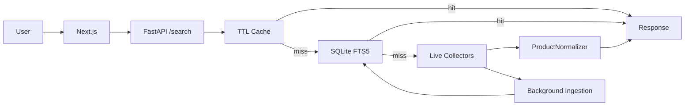
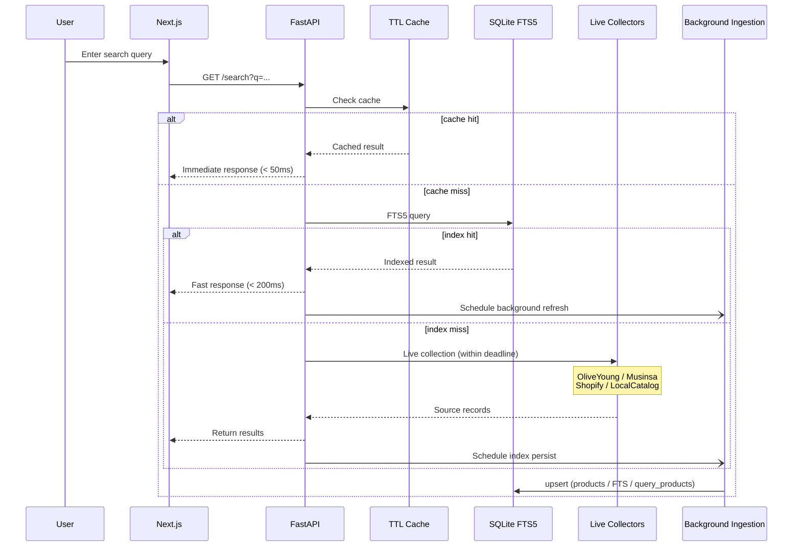
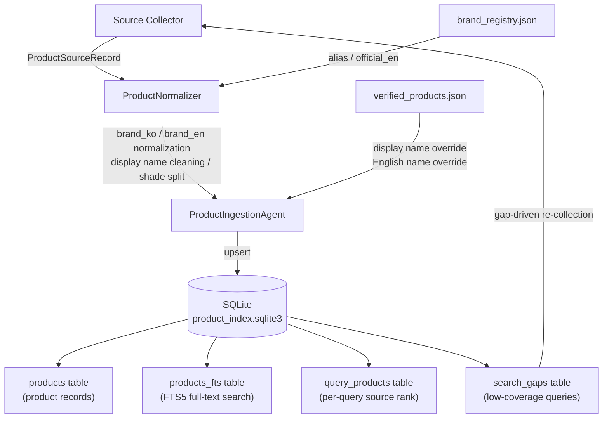

# GlowSearch

A multi-source K-beauty cosmetics search engine.

Search by brand name, English name, sub-brand, product name, category, or shade. Product data is normalized and indexed from multiple trusted sources. Searches hit the TTL cache → SQLite FTS5 index → live collectors in order, returning results as fast as possible.


---

## Live URLs

| | URL |
| --- | --- |
| Frontend | [https://frontend-plum-six-32.vercel.app](https://frontend-plum-six-32.vercel.app) |
| Backend health | [https://glowsearch-backend.onrender.com/health](https://glowsearch-backend.onrender.com/health) |
| Search API example | [https://glowsearch-backend.onrender.com/search?q=%EB%A1%9C%EC%85%98&limit=4](https://glowsearch-backend.onrender.com/search?q=%EB%A1%9C%EC%85%98&limit=4) |

The current deployed commit is in the `release_sha` field of the `/health` response.

---

## Why

K-beauty search is hard: Korean brand names, English names, sub-brands, product names, ingredients, and categories are all mixed together. `too cool`, `TOO COOL FOR SCHOOL`, and `투쿨포스쿨` all refer to the same brand. Searching `정샘물` should also return `비긴스 바이 정샘물`.

GlowSearch doesn't re-crawl everything on every request. It collects, normalizes, and indexes source data, then queries the cache and index first. It also serves beauty YouTube editors with per-line product parsing, source-backed candidate matching, and YouTube description box export.

---

## Key Features

**Search**
- Brand name, English name, sub-brand, product name, category, shade/color search
- Alias resolution: `too cool` / `TOO COOL FOR SCHOOL` / `투쿨포스쿨` → same brand
- Sub-brand expansion: `정샘물` → includes `비긴스 바이 정샘물`
- SQLite FTS5 full-text search index
- Autocomplete, pagination

**Multi-source**
- Source filter tabs: All / Olive Young / Musinsa / Official (with per-tab count badges)
- Olive Young public API, Musinsa Beauty direct collector, brand official Shopify stores, verified catalog
- Per-source timeout / retry / graceful fallback
- Background ingestion of live results into the index

**Data quality**
- Never fabricate values not provided by the source — no auto-translation, no guessing
- Hide missing fields instead of showing "Unknown" or "N/A"
- `brand_registry.json`-based Korean ↔ English brand normalization
- Verified catalog overrides for display names and English product names

**Editor mode**
- Paste a product list → per-line brand/product/shade parsing → source-backed candidate matching
- **YouTube description box bulk export** (with or without purchase links)
- Shade parser: `#13N1`, `19호`, `#432`, `#그레이쿨`, `카푸치노`, etc.

---

## Architecture

```
Search query
  → GET /search
  → TTL Cache       →  cache hit: return immediately
  → SQLite FTS5     →  index hit: return + schedule background refresh
  → Live collectors (within deadline)
      - OliveYoung Public API
      - Musinsa Beauty (optional)
      - Brand Shopify (optional)
      - LocalVerifiedCatalogCollector
  → ProductNormalizer
  → Return results + persist to index
```



### Request Flow (Detailed)



### Collection → Storage Pipeline



---

## Editor Batch Mode

Paste a product list from a beauty YouTuber's script and get source-backed candidates per line.

**Workflow**

1. Select the `편집자 일괄 정리` tab
2. Paste a product list (one product per line)
3. Click `정리하기` — each line is parsed and up to 5 source-backed candidates are returned
4. If multiple candidates exist, select one
5. Review confirmed brand name, English brand name, product name, English product name, shade
6. Click **YouTube 설명란** to bulk-copy all selected products to clipboard

**Result statuses**
- `확인됨` — one exact source-matched candidate
- `후보 있음` — candidates found, editor review needed
- `수동 확인 필요` — no confirmed source match found

```bash
# Direct API call
curl -X POST https://glowsearch-backend.onrender.com/editor/batch \
  -H "Content-Type: application/json" \
  -d '{"text":"헤라 파우더 #13N1\n롬앤 쉐딩 #그레이쿨","limit":5}'
```

---

## Data Source Priority

| Priority | Source |
| --- | --- |
| 1 | Olive Young (public API) |
| 2 | Musinsa Beauty |
| 3 | Olive Young Global |
| 4 | Brand official website (Shopify `/products.json`) |
| 5 | Verified catalog (`verified_products.json`) |
| 6 | Official/public API, JSON-LD |
| 7 | Managed provider |

**Principles**
- Never fabricate values not provided by the source
- Never auto-translate English product names
- Exclude products without `source_url` or `source_product_id`
- No Cloudflare bypass, captcha evasion, or ToS-violating scraping
- HTML/browser collector is disabled by default

---

## Tech Stack

| Area | Tech |
| --- | --- |
| Frontend | Next.js 16, TypeScript, Tailwind CSS |
| Backend | FastAPI, Python 3.13 |
| Search Index | SQLite FTS5 |
| HTTP collection | httpx (async, timeout/retry/rate limit) |
| Cache | In-memory TTL cache |
| Deployment | Vercel (frontend), Render (backend) |
| Testing | pytest, ruff |

---

## File Structure

```
GlowSearch/
├── frontend/
│   └── src/
│       ├── app/page.tsx        # Search UI, editor mode, source filter, export
│       └── lib/api.ts          # API client
│
└── backend/
    ├── app/
    │   ├── api/                # FastAPI routes (/search, /suggest, /editor/batch, /health, etc.)
    │   ├── cache/              # TTL cache
    │   ├── core/config.py      # Settings (pydantic-settings, GLOWSEARCH_ prefix)
    │   ├── data_collector/     # OliveYoung, Musinsa, Shopify, local catalog, adapters
    │   ├── indexing/           # SQLite FTS5 store, catalog job queue
    │   ├── ingestion/          # Collection pipeline, quality checks, enrichment export
    │   ├── normalizer/         # Brand alias, product name normalization
    │   ├── search_engine/      # Synonym, intent, ranking
    │   └── service/            # SearchService orchestration
    ├── scripts/                # Ops scripts: ingest, audit, refresh, backfill, etc.
    ├── tests/
    └── data/
        ├── brand_registry.json      # Brand KO↔EN + official domain mappings
        ├── verified_products.json   # Manually curated catalog (display name, EN name override)
        └── product_index.sqlite3    # SQLite FTS5 index (runtime)
```

---

## Local Development

### Backend

```bash
cd backend
python3 -m venv .venv
. .venv/bin/activate
pip install -r requirements.txt
uvicorn app.main:app --reload --port 8000
```

### Frontend

```bash
cd frontend
npm install
npm run dev   # http://localhost:3000
```

Frontend local env (`frontend/.env.local`):

```
NEXT_PUBLIC_API_BASE_URL=http://localhost:8000
```

---

## Environment Variables

All backend settings use the `GLOWSEARCH_` prefix (`backend/.env`).

### Required / Recommended

| Variable | Default | Description |
| --- | --- | --- |
| `NEXT_PUBLIC_API_BASE_URL` | — | Backend URL called from the frontend |
| `GLOWSEARCH_PRODUCT_INDEX_PATH` | `data/product_index.sqlite3` | Use `/var/data/product_index.sqlite3` with Render persistent disk |
| `GLOWSEARCH_PRODUCT_INDEX_ADMIN_TOKEN` | — | Token to protect `/index/catalog/run` |

### Collectors

| Variable | Default | Description |
| --- | --- | --- |
| `GLOWSEARCH_OLIVEYOUNG_PUBLIC_API_ENABLED` | `true` | Olive Young public API |
| `GLOWSEARCH_MUSINSA_DIRECT_ENABLED` | `false` | Musinsa Beauty direct collector |
| `GLOWSEARCH_MUSINSA_DIRECT_PAGE_SIZE` | `24` | Musinsa results per page |
| `GLOWSEARCH_BRAND_SHOPIFY_ENABLED` | `false` | Brand official Shopify collector |
| `GLOWSEARCH_MUSINSA_API_ENABLED` + `_BASE_URL` | `false` | Managed Musinsa JSON provider |
| `GLOWSEARCH_OLIVEYOUNG_GLOBAL_API_ENABLED` + `_BASE_URL` | `false` | Managed OliveYoung Global provider |
| `GLOWSEARCH_OFFICIAL_BRAND_API_ENABLED` + `_BASE_URL` | `false` | Brand official catalog JSON provider |

### Timing

| Variable | Default | Description |
| --- | --- | --- |
| `GLOWSEARCH_LIVE_COLLECT_DEADLINE_SECONDS` | `3.2` | Live collection deadline. `7.0` recommended for better coverage |
| `GLOWSEARCH_BACKGROUND_COLLECT_DEADLINE_SECONDS` | `18.0` | Background refresh deadline |
| `GLOWSEARCH_CACHE_TTL_SECONDS` | `180` | Cache TTL |

### Index Operations

| Variable | Default | Description |
| --- | --- | --- |
| `GLOWSEARCH_PRODUCT_INDEX_VERIFIED_CATALOG_BACKFILL_ON_STARTUP` | `true` | Backfill verified catalog on startup |
| `GLOWSEARCH_PRODUCT_INDEX_WARMUP_ON_STARTUP` | `false` | Run seed warmup on startup |
| `GLOWSEARCH_PRODUCT_INDEX_BACKGROUND_REFRESH_LIMIT` | `240` | Background refresh result count |
| `GLOWSEARCH_RESULT_SOURCE_PREFIXES` | `oliveyoung,musinsa,official,...` | Allowed source prefix list |

---

## API Reference

### `GET /search`

```bash
curl "https://glowsearch-backend.onrender.com/search?q=로션&limit=48"
```

| Parameter | Description |
| --- | --- |
| `q` | Search query |
| `brand` | Brand filter |
| `min_price` / `max_price` | Price range |
| `limit` | Result count (1–480) |

Response example:

```json
{
  "query": "로션",
  "count": 1,
  "results": [
    {
      "brand_ko": "에스트라",
      "brand_en": "AESTURA",
      "product_name_ko": "아토베리어365 로션",
      "product_name_en": null,
      "price": 29700,
      "original_price": 33000,
      "sale_price": 29700,
      "discount_rate": 10,
      "source": "oliveyoung",
      "source_url": "https://www.oliveyoung.co.kr/...",
      "offers": [...]
    }
  ]
}
```

### Other Endpoints

| Endpoint | Description |
| --- | --- |
| `GET /suggest?q=투&limit=10` | Autocomplete suggestions |
| `POST /editor/batch` | Editor batch mode |
| `GET /index/status` | Index status |
| `GET /index/catalog/status` | Catalog job status |
| `POST /index/catalog/run` | Run pending jobs (admin token required) |
| `GET /diagnostics` | Cache/index/source/gap diagnostics |
| `GET /health` | Status and `release_sha` |

---

## Index Operations

Search coverage grows by running small batches repeatedly.

```bash
cd backend

# Queue seed/brand/category/gap queries and process a small batch
.venv/bin/python scripts/refresh_coverage.py \
  --coverage-pairs 300 --max-jobs 50 --limit 120

# Priority fill for a specific missing brand
.venv/bin/python scripts/refresh_coverage.py \
  --query "비긴스 바이 정샘물" \
  --no-default-seeds --no-gaps \
  --coverage-pairs 0 --max-jobs 1 --limit 48

# Audit index quality
.venv/bin/python scripts/audit_index_quality.py \
  --fail-on-required --fail-on-dirty-display

# Re-normalize existing rows after brand_registry/normalizer changes
.venv/bin/python scripts/backfill_index_normalized_fields.py --apply

# Run pending jobs remotely from production backend
curl -X POST \
  "https://glowsearch-backend.onrender.com/index/catalog/run?max_jobs=20&limit=120&token=$GLOWSEARCH_PRODUCT_INDEX_ADMIN_TOKEN"
```

### Catalog Enrichment

Export records missing English product names, images, or prices for manual review.

```bash
# Export enrichment targets as CSV
.venv/bin/python scripts/export_catalog_enrichment_targets.py \
  --max-targets 40 --format csv

# Audit source URLs for English name evidence (read-only)
.venv/bin/python scripts/audit_catalog_enrichment_sources.py \
  --field product_name_en --only-usable --format csv
```

---

## Testing

```bash
cd backend
.venv/bin/python -m ruff check app tests scripts
.venv/bin/python -m pytest

cd frontend
npm run build
npm run typecheck
```

Smoke test:

```bash
cd backend
.venv/bin/python scripts/smoke_search.py \
  --base-url https://glowsearch-backend.onrender.com --limit 4
```

---

## Deployment

| Area | Platform | Trigger |
| --- | --- | --- |
| Frontend | Vercel | Auto-deploy on `main` push |
| Backend | Render | Auto-deploy on `main` push |

Post-deploy checklist:

```bash
curl https://glowsearch-backend.onrender.com/health
curl "https://glowsearch-backend.onrender.com/search?q=롬앤&limit=4"
curl "https://glowsearch-backend.onrender.com/index/status"
```

> **Note**: Render's free filesystem resets the SQLite index on each deploy. For production, mount a Render persistent disk at `/var/data` or migrate to an external database.

---

## Limitations & Roadmap

**Current limitations**
- Olive Young full catalog coverage is not yet 100%
- Render free filesystem resets the SQLite index on redeploy
- English brand names not in source or `brand_registry.json` default to `null`
- Full catalog coverage without official API/licensed data is difficult to maintain

**Roadmap**
- Render persistent disk or Postgres migration
- Meilisearch/Typesense for typo-tolerant prefix search
- `search_gaps`-driven auto-warmup
- Automated brand alias enrichment
- Managed scraping/API provider integration
- Official/licensed data source acquisition
