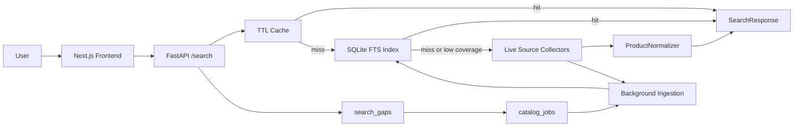
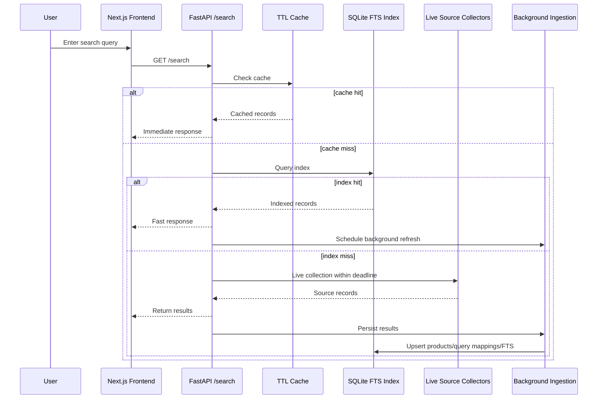

# GlowSearch

A multi-source K-beauty product search engine.

GlowSearch lets you search cosmetics by brand name, English name, sub-brand, product name, category keyword, or shade/color. It combines a TTL cache, SQLite FTS5 index, and background live collection to maximize search coverage. Rather than a simple search UI, it normalizes and indexes product data from multiple trusted sources to deliver accurate, complete cosmetics information.


## Live URLs

| | URL |
| --- | --- |
| Frontend | [https://frontend-plum-six-32.vercel.app/](https://frontend-plum-six-32.vercel.app/) |
| Backend health | [https://glowsearch-backend.onrender.com/health](https://glowsearch-backend.onrender.com/health) |
| Search API example | [https://glowsearch-backend.onrender.com/search?q=%EB%A1%9C%EC%85%98&limit=4](https://glowsearch-backend.onrender.com/search?q=%EB%A1%9C%EC%85%98&limit=4) |

The current deployed commit is available at `release_sha` in the `/health` response.

## Recent Updates

### 2026-06-29

Editor batch export, multi-source collector implementations, and source-aware UI redesign.

- Deleted `typesense_provider.py` — unused stub with only `NotImplementedError`.
- Removed unused frontend types (`AdapterReadiness`, `DiagnosticsResponse`, `EditorConfirmRequest/Response`) and dead API client functions (`fetchDiagnostics`, `confirmEditorCandidate`).
- **Added YouTube Description Box export to editor batch mode.** "YouTube 설명란" copies selected products with purchase links; "목록만" copies names only. A 1.5s "Copied" feedback appears after each export.
- **Added Musinsa Beauty direct collector** (`backend/app/data_collector/musinsa.py`). Enable with `GLOWSEARCH_MUSINSA_DIRECT_ENABLED=true`. Bot detection responses fall back gracefully via `SourceUnavailableError`.
- **Added brand official Shopify store collector** (`backend/app/data_collector/brand_shopify.py`). Enable with `GLOWSEARCH_BRAND_SHOPIFY_ENABLED=true`. Fetches from Shopify's standard `/products.json` endpoint for brands in `brand_registry.json` whose aliases appear in the search keyword.
- Added `musinsa_direct_*` and `brand_shopify_*` settings to `config.py` and wired both collectors into `factory.py`.
- **Added source filter tabs** to search results (All / Olive Young / Musinsa / Official). Each tab shows a result-count badge. When a filter is active, all matching results are shown without pagination.
- Added per-source brand colors to Tailwind config: Olive Young (`#00a862`), Musinsa (`#161616`), Official (`#b07d3a`).
- Source badge and product card now reflect per-source colors. A 3px left-edge accent stripe on each card indicates the source.

### 2026-06-21

Tooling and data quality for the verified catalog enrichment workflow.

- Added `backend/scripts/export_catalog_enrichment_targets.py` — exports records missing `product_name_en`, `image_url`, `price`, or `brand_en` as CSV/JSON/JSONL for batch review.
- Added `backend/scripts/audit_catalog_enrichment_sources.py` — checks source URLs for Latin product name evidence via JSON-LD/meta/title, outputs `usable_for_target_field` per record.
- Added `--plan-only` to `refresh_coverage.py` for dry-run preview.
- Added `--reset-stale-running-minutes` to `refresh_coverage.py` and `/index/catalog/run`.
- SQLite product index now stores `product_name_display_ko` and `product_name_display_en` in FTS.
- Added `backend/scripts/audit_index_quality.py` and `backend/scripts/backfill_index_normalized_fields.py`.
- Brand registry expanded with 80+ brands with confirmed official domains.

## Project Goals

GlowSearch helps users find cosmetics by brand name, English name, product name, category, or shade by pulling from trusted sources. Results are ranked by accuracy, source reliability, data completeness, price availability, and English name coverage.

Core product card fields (when available):

- Brand name (Korean)
- Brand name (English)
- Product name (Korean)
- Product name (English)
- Price
- Sale price (when discounted)
- Product image
- Source badge

Data source priority:

1. Olive Young
2. Musinsa Beauty
3. Olive Young Global
4. Brand official website
5. Verified catalog
6. Official/public API
7. Public JSON / JSON-LD Product schema
8. Managed provider

Core principles:

- Never fabricate brand names, product names, prices, images, or English names.
- Never auto-translate English product names.
- Only use values confirmed by `brand_registry`, verified catalog, official APIs, public JSON, or official websites.
- Hide missing fields rather than replacing them with "Unknown", "N/A", or similar placeholder text.
- Exclude products without `source_url` or `source_product_id`.
- No bot bypass, captcha evasion, or ToS-violating scraping.

## Key Features

- Brand name, English name, product name, category keyword search
- Alias search: `too cool`, `TOO COOL FOR SCHOOL`, `투쿨포스쿨`
- Sub-brand expansion: `정샘물` → `비긴스 바이 정샘물`
- SQLite FTS5 full-text search index
- TTL cache + SQLite index first; live source collection as fallback
- Per-source timeout, retry, rate limit, graceful fallback
- Background ingestion of live results into the index
- `search_gaps` tracks low-coverage queries; `catalog_jobs` drives background refresh
- Multi-source offer merging into a single product card
- Price, sale price, discount rate display
- Autocomplete, pagination, source badge UI
- **Editor batch mode** — paste a product list, get per-line brand/product/shade parsing and source-backed candidates
- **YouTube Description Box export** (with or without purchase links)
- **Source filter tabs** (Olive Young / Musinsa / Official) with count badges
- **Musinsa Beauty direct collector** (`GLOWSEARCH_MUSINSA_DIRECT_ENABLED=true`)
- **Brand official Shopify store collector** (`GLOWSEARCH_BRAND_SHOPIFY_ENABLED=true`)
- Shade parser: `#13N1`, `19호`, `#432`, `#그레이쿨`, `카푸치노`, `#핑크올로지`, etc.
- Catalog enrichment target CSV/JSONL export

## Editor Batch Mode

GlowSearch includes an editor mode for beauty YouTube editors who need to quickly organize product lists for scripts, subtitles, or YouTube descriptions.

Workflow:

1. Select the `편집자 일괄 정리` tab.
2. Paste a product list (one product per line).
3. Click `정리하기` — each line is parsed and up to 3–5 source-backed candidates are returned.
4. If multiple candidates exist, the editor picks one.
5. Confirm brand name, English brand name, product name, English product name, and shade from the source.
6. Use **YouTube 설명란** to bulk-copy the selection as a formatted description box.
7. Use **목록만** to copy names only.

API:

```bash
curl -X POST https://glowsearch-backend.onrender.com/editor/batch \
  -H "Content-Type: application/json" \
  -d '{"text":"헤라 파우더 #13N1\n롬앤 쉐딩 #그레이쿨","limit":5}'
```

Each line in the response includes:

- Original input text
- Parsed brand query, product query, shade number, shade name/color
- Source-backed candidate products
- Status: `확인됨` (confirmed), `후보 있음` (candidates available), `수동 확인 필요` (manual review needed)

## Tech Stack

| Area | Tech | Why |
| --- | --- | --- |
| Frontend | Next.js | Search UI, deployment, static/dynamic rendering |
| Backend | FastAPI | Fast API server, typed request/response |
| Language | TypeScript, Python | UI safety, data collection/normalization |
| Search Index | SQLite + FTS5 | Fast full-text search, simple deployment |
| Data Collection | httpx | Async HTTP, timeout/retry/rate limit control |
| Parsing | BeautifulSoup4 | Conservative HTML parsing fallback |
| Cache | In-memory TTL cache | Reduces time-to-first-result for repeat searches |
| Deployment | Vercel, Render | Separate frontend/backend deployment |
| Test | pytest | Collector, normalizer, indexing, cache, orchestration |

## File Structure

```text
GlowSearch/
  frontend/
    src/app/
      page.tsx        # Search UI, autocomplete, result cards, pagination, editor batch, export
      layout.tsx      # Metadata, favicon
      globals.css     # Global styles
    tailwind.config.ts  # Brand colors (oy-green, ms-black, official-gold, etc.)

  backend/
    app/
      api/            # FastAPI routes, health, diagnostics, index status
      cache/          # TTL cache
      core/           # Settings (pydantic-settings, GLOWSEARCH_ prefix)
      data_collector/ # Olive Young, Musinsa Beauty, brand Shopify, local catalog, optional provider adapters
      indexing/       # SQLite product index, FTS, catalog job queue
      ingestion/      # Safe collection pipeline, retry/backoff, CSV export
      normalizer/     # Brand alias, product record normalization
      observability/  # Latency, cache/index/source metrics
      search_engine/  # Synonym, intent, ranking
      service/        # SearchService orchestration
    scripts/
      ingest_oliveyoung.py
      refresh_coverage.py
      audit_catalog_quality.py
      audit_index_quality.py
      export_catalog_enrichment_targets.py
      backfill_index_normalized_fields.py
      smoke_search.py
      benchmark_search.py
    tests/
    data/
      brand_registry.json       # Brand KO↔EN name + official domain mappings
      verified_products.json    # Manually curated canonical product catalog
      product_index.sqlite3     # SQLite FTS5 search index (runtime)
```

## Architecture



## Search Data Flow



## DB / Index Schema

| Table | Purpose |
| --- | --- |
| `products` | Source-provided product records |
| `query_products` | Per-query source rank preservation |
| `products_fts` | Brand, product name, category, options, alias full-text search |
| `brand_aliases` | Korean/English/sub-brand alias connections |
| `search_gaps` | Queries with no or low coverage results |
| `catalog_jobs` | Seed/gap-based background ingestion queue |

## API Reference

### `GET /search`

```bash
curl "https://glowsearch-backend.onrender.com/search?q=로션&limit=48"
```

| Parameter | Description |
| --- | --- |
| `q` | Search query |
| `keyword` | Alias for `q` |
| `brand` | Brand filter |
| `min_price` | Minimum price |
| `max_price` | Maximum price |
| `has_shade` | Filter by shade/color presence |
| `limit` | Number of results, 1–480 |

### Other Endpoints

| Endpoint | Description |
| --- | --- |
| `GET /suggest?q=투&limit=10` | Autocomplete suggestions |
| `GET /index/status` | Product index status |
| `GET /index/catalog/status` | Catalog ingestion job status |
| `POST /index/catalog/run` | Run pending catalog jobs (requires admin token) |
| `GET /diagnostics` | Cache/index/source/gap/job diagnostics |
| `GET /health` | Backend status and `release_sha` |

## Local Development

### Backend

```bash
cd backend
python3 -m venv .venv
. .venv/bin/activate
pip install -r requirements.txt
uvicorn app.api.main:app --reload --port 8000
```

### Frontend

```bash
cd frontend
npm install
npm run dev
```

Frontend local env:

```bash
NEXT_PUBLIC_API_BASE_URL=http://localhost:8000
```

## Environment Variables

| Variable | Description |
| --- | --- |
| `NEXT_PUBLIC_API_BASE_URL` | Backend API base URL called from the frontend |
| `GLOWSEARCH_PRODUCT_INDEX_PATH` | SQLite index path. Use `/var/data/product_index.sqlite3` with Render persistent disk |
| `GLOWSEARCH_OLIVEYOUNG_PUBLIC_API_ENABLED` | Enable Olive Young public JSON adapter |
| `GLOWSEARCH_OLIVEYOUNG_PUBLIC_API_TIMEOUT_SECONDS` | Olive Young adapter timeout. `6.0`+ recommended for broad queries |
| `GLOWSEARCH_LIVE_COLLECT_DEADLINE_SECONDS` | Total live source deadline per search. `7.0` recommended for better coverage |
| `GLOWSEARCH_BACKGROUND_COLLECT_DEADLINE_SECONDS` | Background refresh deadline. `18.0`+ recommended for catalog jobs |
| `GLOWSEARCH_MUSINSA_DIRECT_ENABLED` | Enable Musinsa Beauty direct collector. Default off |
| `GLOWSEARCH_MUSINSA_DIRECT_PAGE_SIZE` | Results per page for Musinsa collector. Default `24` |
| `GLOWSEARCH_BRAND_SHOPIFY_ENABLED` | Enable brand official Shopify store collector. Default off |
| `GLOWSEARCH_MUSINSA_API_ENABLED` / `GLOWSEARCH_MUSINSA_API_BASE_URL` | Managed Musinsa Beauty JSON provider. Default off |
| `GLOWSEARCH_OLIVEYOUNG_GLOBAL_API_ENABLED` / `GLOWSEARCH_OLIVEYOUNG_GLOBAL_API_BASE_URL` | Managed Olive Young Global JSON provider. Default off |
| `GLOWSEARCH_OFFICIAL_BRAND_API_ENABLED` / `GLOWSEARCH_OFFICIAL_BRAND_API_BASE_URL` | Brand official catalog JSON provider. Default off |
| `GLOWSEARCH_PRODUCT_INDEX_VERIFIED_CATALOG_BACKFILL_ON_STARTUP` | Backfill `verified_products.json` into SQLite on startup. Recommended `true` in production |
| `GLOWSEARCH_PRODUCT_INDEX_WARMUP_ON_STARTUP` | Run seed warmup on startup. Keep small batch and low concurrency |
| `GLOWSEARCH_PRODUCT_INDEX_ADMIN_TOKEN` | Token to protect `/index/warm` and `/index/catalog/run` |
| `GLOWSEARCH_PRODUCT_INDEX_BACKGROUND_REFRESH_LIMIT` | Background refresh count per search. `48–120` recommended initially |
| `GLOWSEARCH_RESULT_SOURCE_PREFIXES` | Allowed source prefix list. Default: `oliveyoung,oliveyoung-global,official,musinsa,coupang,hwahae,glowpick,fudejapan,managed,barcode,discovery,external` |
| `GLOWSEARCH_BROWSER_COLLECTOR_ENABLED` | Enable Playwright/browser fallback. Default off |

## Data Collection Principles

- Only store values provided by the source.
- Never fabricate prices, brand names, English names, product names, images, review counts, or options.
- Not a full unlimited crawler. Coverage grows through search gaps, seed/category queries, verified catalog, and provider adapters in small batches.
- Deduplicate by Olive Young `goodsNo`.
- Do not bypass Cloudflare, captcha, login walls, 403, 429, 503, rate limits, or ToS restrictions.
- HTML/browser collector is disabled by default.
- In production, prefer official APIs, licensed data, and managed scraping providers.
- Musinsa Beauty, Olive Young Global, and brand official stores connect as live collectors only when a verified JSON/API provider URL is configured.

## Deployment

| Area | Platform | Notes |
| --- | --- | --- |
| Frontend | Vercel | Next.js app deployment |
| Backend | Render | FastAPI Docker web service |

Check the current deployed commit:

```bash
curl https://glowsearch-backend.onrender.com/health
```

Render's free filesystem does not persist the SQLite index across deploys. For production, mount a Render persistent disk at `/var/data` and set `GLOWSEARCH_PRODUCT_INDEX_PATH=/var/data/product_index.sqlite3`, or migrate to Postgres/an external search engine.

Post-deploy checklist:

```bash
curl https://glowsearch-backend.onrender.com/health
curl https://glowsearch-backend.onrender.com/index/status
curl "https://glowsearch-backend.onrender.com/search?q=롬앤&limit=4"
curl "https://glowsearch-backend.onrender.com/search?q=too%20cool&limit=4"
```

## Catalog Indexing Operations

```bash
cd backend

# Queue seed/brand/category/gap queries and process a small batch
.venv/bin/python scripts/refresh_coverage.py \
  --coverage-pairs 300 \
  --max-jobs 50 \
  --limit 120

# Priority fill for a specific missing brand/product
.venv/bin/python scripts/refresh_coverage.py \
  --query "비긴스 바이 정샘물" \
  --no-default-seeds --no-gaps \
  --coverage-pairs 0 --max-queries 1 \
  --job-priority 0 --max-jobs 1 --limit 48

# Export full index to CSV
.venv/bin/python scripts/refresh_coverage.py \
  --export-only --csv data/products_export.csv

# Audit index quality
.venv/bin/python scripts/audit_index_quality.py \
  --max-issues 80 --fail-on-required --fail-on-dirty-display

# Re-normalize existing index rows after brand_registry/normalizer changes
.venv/bin/python scripts/backfill_index_normalized_fields.py
.venv/bin/python scripts/backfill_index_normalized_fields.py --apply

# Run pending catalog jobs from production backend
curl -X POST \
  "https://glowsearch-backend.onrender.com/index/catalog/run?max_jobs=20&limit=120&reset_stale_running_minutes=60&token=$GLOWSEARCH_PRODUCT_INDEX_ADMIN_TOKEN"
```

## Testing

```bash
cd backend
.venv/bin/python -m ruff check app tests scripts
.venv/bin/python -m pytest

cd frontend
npm run build
```

Smoke tests:

```bash
cd backend
.venv/bin/python scripts/smoke_search.py --base-url http://localhost:8000 --limit 4
.venv/bin/python scripts/smoke_search.py --base-url https://glowsearch-backend.onrender.com --limit 4
```

## Limitations and Roadmap

### Current Limitations

- Olive Young full catalog coverage is not yet 100%.
- Render free filesystem does not persist the SQLite index.
- English brand names missing from source and `brand_registry.json` default to `null`.
- Maintaining full catalog coverage without official API/licensed data is difficult.
- HTML/browser collector is disabled by default due to compliance and blocking risks.

### Roadmap

- Render persistent disk or Postgres migration
- Meilisearch/Typesense for typo-tolerant prefix search
- Automated brand alias enrichment workflow
- `search_gaps`-driven auto-warmup
- Managed scraping/API provider integration
- Official/licensed data source acquisition
