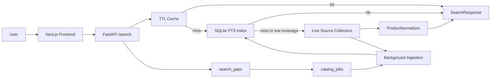
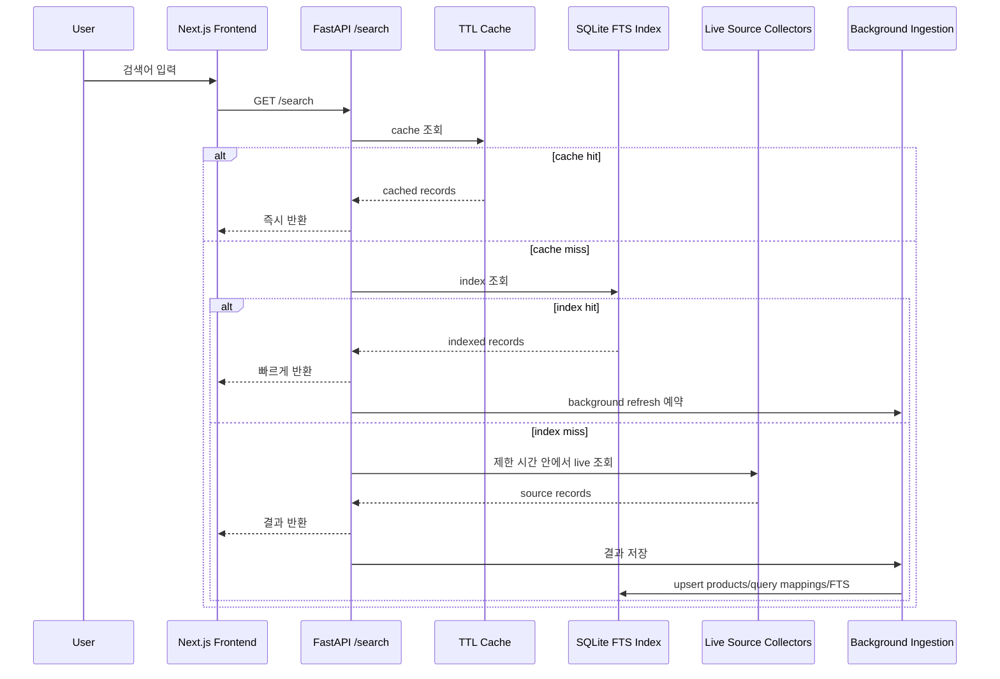

# GlowSearch

Olive Young 중심의 화장품 상품 검색 엔진입니다.

GlowSearch는 브랜드명, 영문명, 하위 브랜드, 상품명, 카테고리 키워드로 화장품을 검색하고, 캐시/검색 인덱스/백그라운드 수집으로 검색 커버리지를 확장하는 Next.js + FastAPI 프로젝트입니다. 단순 검색 UI가 아니라, source 기반 상품 데이터를 정규화하고 색인하는 데이터 파이프라인까지 포함합니다.


## 배포 링크

| 항목 | URL |
| --- | --- |
| Frontend | [https://glow-search.vercel.app/](https://glow-search.vercel.app/) |
| Backend health | [https://glowsearch-backend.onrender.com/health](https://glowsearch-backend.onrender.com/health) |
| Search API 예시 | [https://glowsearch-backend.onrender.com/search?q=%EB%A1%9C%EC%85%98&limit=4](https://glowsearch-backend.onrender.com/search?q=%EB%A1%9C%EC%85%98&limit=4) |

백엔드의 현재 배포 커밋은 `/health` 응답의 `release_sha`로 확인할 수 있습니다.

## 만들게 된 계기

화장품 검색은 한글 브랜드명, 영문 브랜드명, 하위 브랜드, 상품명, 성분명, 카테고리명이 섞여 있어 원하는 상품을 빠르게 찾기 어렵습니다. 예를 들어 `too cool`, `TOO COOL FOR SCHOOL`, `투쿨포스쿨`은 같은 브랜드를 가리키고, `정샘물` 검색에는 `비긴스 바이 정샘물` 같은 하위 브랜드도 함께 고려해야 합니다.

GlowSearch는 검색 요청마다 모든 상품을 실시간으로 수집하는 방식이 아니라, 실제 source가 제공한 상품 데이터를 수집/정규화/색인하고 캐시와 인덱스를 먼저 조회해 빠르게 결과를 보여주는 검색 엔진을 목표로 만들었습니다.

## 핵심 기능

- 브랜드명, 영문명, 상품명, 카테고리 키워드 검색
- `too cool`, `TOO COOL FOR SCHOOL`, `투쿨포스쿨` 같은 alias 검색
- `정샘물`, `비긴스 바이 정샘물` 같은 하위 브랜드 검색 확장
- SQLite FTS5 기반 빠른 인덱스 검색
- TTL cache와 SQLite index 우선 반환
- 인덱스 결과가 부족할 때 제한 시간 안에서 live source collector 보강
- live 결과를 background ingestion으로 인덱스에 저장
- `search_gaps`로 결과 없음/부족 검색어 기록
- `catalog_jobs` queue로 seed, 브랜드, 카테고리, 검색 gap 기반 수집 작업 관리
- Olive Young source attribution 유지
- 원가, 할인가, 할인율 표시
- 자동완성, 페이지네이션, source badge UI

## 기술 스택

| 영역 | 기술 | 사용 이유 |
| --- | --- | --- |
| Frontend | Next.js | 검색 UI, 배포, 정적/동적 화면 구성 |
| Backend | FastAPI | 빠른 API 서버, 타입 기반 request/response 처리 |
| Language | TypeScript, Python | UI 안정성, 데이터 수집/정규화 구현 |
| Search Index | SQLite + FTS5 | 로컬/소규모 운영에서 빠른 전문 검색과 쉬운 배포 |
| Data Collection | httpx | 비동기 HTTP 수집, timeout/retry/rate limit 제어 |
| Parsing | BeautifulSoup4 | 보수적인 HTML parsing fallback |
| Cache | In-memory TTL cache | 반복 검색의 time-to-first-result 단축 |
| Deployment | Vercel, Render | 프론트/백엔드 분리 배포 |
| Test | pytest | collector, normalizer, indexing, cache, orchestration 검증 |

## 파일 구조

```text
GlowSearch/
  frontend/
    src/app/
      page.tsx        # 검색 UI, 자동완성, 결과 카드, 페이지네이션
      layout.tsx      # 메타데이터, favicon
      globals.css     # 전역 스타일

  backend/
    app/
      api/            # FastAPI routes, health, diagnostics, index status
      cache/          # TTL cache
      core/           # 환경 변수와 설정
      data_collector/ # Olive Young, local catalog, optional provider adapters
      indexing/       # SQLite product index, FTS, catalog job queue
      ingestion/      # 안전 수집 pipeline, retry/backoff, CSV export
      normalizer/     # 브랜드 alias, 상품 record 정규화
      observability/  # latency, cache/index/source metrics
      search/         # synonym, search key
      service/        # SearchService orchestration
    scripts/
      ingest_oliveyoung.py
      benchmark_search.py
    tests/
```

## 아키텍처



## 검색 데이터 흐름



## DB/index 구조

| 테이블 | 역할 |
| --- | --- |
| `products` | source가 제공한 상품 record 저장 |
| `query_products` | 검색어별 source rank 보존 |
| `products_fts` | 브랜드, 상품명, 카테고리, 옵션, alias 기반 검색 |
| `brand_aliases` | 한글/영문/하위 브랜드 alias 연결 |
| `search_gaps` | 결과 없음/부족 검색어 기록 |
| `catalog_jobs` | seed/search gap 기반 background catalog ingestion queue |

## API 문서

### `GET /search`

```bash
curl "https://glowsearch-backend.onrender.com/search?q=로션&limit=48"
```

주요 query parameter:

| 파라미터 | 설명 |
| --- | --- |
| `q` | 검색어 |
| `keyword` | `q` alias |
| `brand` | 브랜드 필터 |
| `min_price` | 최소 가격 |
| `max_price` | 최대 가격 |
| `has_shade` | 색상/호수 존재 여부 |
| `limit` | 반환 개수, 1~480 |

응답 예시:

```json
{
  "query": "로션",
  "count": 1,
  "results": [
    {
      "brand_ko": "에스트라",
      "brand_en": "AESTURA",
      "product_name_ko": "에스트라 아토베리어365 로션 150ml",
      "price": 29700,
      "original_price": 33000,
      "sale_price": 29700,
      "discount_rate": 10,
      "source": "oliveyoung",
      "source_label": "Olive Young"
    }
  ],
  "source_errors": []
}
```

### 기타 endpoint

| Endpoint | 설명 |
| --- | --- |
| `GET /suggest?q=투&limit=10` | 자동완성 후보 |
| `GET /index/status` | 상품 인덱스 상태 |
| `GET /index/catalog/status` | catalog ingestion job 상태 |
| `GET /diagnostics` | cache/index/source/gap/job 진단 정보 |
| `GET /health` | backend 상태와 `release_sha` |

## 로컬 실행

### Backend

```bash
cd backend
python3 -m venv .venv
. .venv/bin/activate
pip install -r requirements.txt
uvicorn app.api.main:app --reload --port 8000
```

### Frontend

```bash
cd frontend
npm install
npm run dev
```

프론트 로컬 환경:

```bash
NEXT_PUBLIC_API_BASE_URL=http://localhost:8000
```

## 환경 변수

| 변수 | 설명 |
| --- | --- |
| `NEXT_PUBLIC_API_BASE_URL` | 프론트에서 호출할 백엔드 API base URL |
| `GLOWSEARCH_PRODUCT_INDEX_PATH` | SQLite product index 경로 |
| `GLOWSEARCH_OLIVEYOUNG_PUBLIC_API_ENABLED` | Olive Young 공개 JSON adapter 사용 여부 |
| `GLOWSEARCH_PRODUCT_INDEX_WARMUP_ON_STARTUP` | 서버 시작 시 seed index warmup 실행 여부 |
| `GLOWSEARCH_PRODUCT_INDEX_ADMIN_TOKEN` | 원격 `/index/warm` 보호 token |
| `GLOWSEARCH_RESULT_SOURCE_PREFIXES` | 결과에 허용할 source prefix 목록 |
| `GLOWSEARCH_BROWSER_COLLECTOR_ENABLED` | Playwright/browser fallback 사용 여부, 기본 비활성화 |

## 데이터 수집 원칙

- 상품 데이터는 source가 제공한 값만 저장합니다.
- 없는 가격, 브랜드명, 영문명, 상품명, 이미지, 리뷰 수, 옵션은 만들지 않습니다.
- 같은 Olive Young `goodsNo`는 하나의 상품으로 dedupe합니다.
- Cloudflare, captcha, login wall, 403, 429, 503, rate limit, terms 이슈가 보이면 우회하지 않습니다.
- `robots.txt`와 서비스 약관을 확인하지 않은 대량 수집은 실행하지 않습니다.
- HTML/browser collector는 기본 비활성화되어 있습니다.
- 운영에서는 공식 API, 제휴 데이터, managed scraping provider를 우선 검토합니다.

## 카탈로그 인덱싱 운영

현재 구조는 검색 요청과 카탈로그 수집을 분리합니다. 검색은 cache/index를 우선 조회하고, 전체 카탈로그에 가까운 DB snapshot은 별도 ingestion job으로 확장합니다.

```bash
cd backend

# seed, 브랜드, 카테고리, 브랜드+카테고리 조합을 catalog job으로 등록
.venv/bin/python scripts/ingest_oliveyoung.py \
  --use-default-seeds \
  --coverage-pairs 300 \
  --enqueue-catalog \
  --db-path data/product_index.sqlite3

# search_gaps에 쌓인 부족 검색어를 수집 후보로 등록
.venv/bin/python scripts/ingest_oliveyoung.py \
  --include-gaps \
  --enqueue-catalog \
  --job-priority 20 \
  --db-path data/product_index.sqlite3

# catalog job을 작은 batch로 실행
.venv/bin/python scripts/ingest_oliveyoung.py \
  --run-catalog-jobs \
  --max-jobs 50 \
  --limit 240 \
  --db-path data/product_index.sqlite3
```

## 테스트/검증

Backend:

```bash
cd backend
.venv/bin/python -m ruff check app tests scripts
.venv/bin/python -m pytest
```

Frontend:

```bash
cd frontend
npm run build
```

API smoke test:

```bash
curl https://glowsearch-backend.onrender.com/health
curl "https://glowsearch-backend.onrender.com/search?q=too%20cool&limit=4"
curl "https://glowsearch-backend.onrender.com/search?q=%EC%A0%95%EC%83%98%EB%AC%BC&limit=48"
```

Benchmark:

```bash
cd backend
.venv/bin/python scripts/benchmark_search.py --base-url http://localhost:8000 --repeat 3
.venv/bin/python scripts/benchmark_search.py --base-url https://glowsearch-backend.onrender.com --repeat 3
```

## 배포

| 영역 | 플랫폼 | 설명 |
| --- | --- | --- |
| Frontend | Vercel | Next.js app 배포 |
| Backend | Render | FastAPI Docker web service 배포 |

Render backend는 `/health`의 `release_sha`로 현재 배포 commit을 확인합니다.

```bash
curl https://glowsearch-backend.onrender.com/health
```

Render free filesystem은 SQLite index 보존에 적합하지 않습니다. 장기 운영에서는 persistent disk 또는 Postgres 전환이 필요합니다.

## 한계와 개선 계획

### 현재 한계

- Olive Young 전체 상품 100% 보장은 아직 아닙니다.
- Render free filesystem은 SQLite index 보존에 적합하지 않습니다.
- 일부 브랜드 영문명은 source나 `brand_registry.json`에 없으면 `null`입니다.
- 공식 API/제휴 데이터 없이 전체 카탈로그를 안정적으로 유지하는 데 한계가 있습니다.
- 현재 Olive Young HTML/browser collector는 준수/차단 리스크 때문에 기본 비활성화되어 있습니다.

### 개선 계획

- Render persistent disk 또는 Postgres 도입
- Meilisearch/Typesense 기반 typo/prefix search
- 브랜드 alias 자동 보강 workflow
- `search_gaps` 기반 자동 warmup
- managed scraping/API provider 연동
- 공식/제휴 데이터 소스 확보
