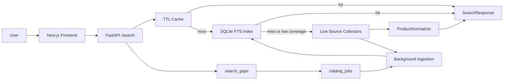
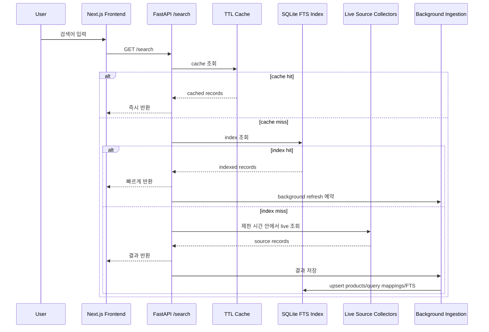

# GlowSearch

멀티 소스 기반 화장품 상품 검색 엔진입니다.

GlowSearch는 브랜드명, 영문명, 하위 브랜드, 상품명, 카테고리 키워드, 색상/호수로 화장품을 검색하고, 캐시/검색 인덱스/백그라운드 수집으로 검색 커버리지를 확장하는 Next.js + FastAPI 프로젝트입니다. 단순 검색 UI가 아니라, 여러 신뢰 가능한 source의 상품 데이터를 정규화하고 색인해 사용자가 원하는 화장품 정보를 정확하고 완성도 높게 보여주는 검색 서비스입니다.


## 배포 링크

| 항목 | URL |
| --- | --- |
| Frontend | [https://glow-search.vercel.app/](https://glow-search.vercel.app/) |
| Last verified Vercel deployment | [https://glow-search-8q8gz8wvt-amuldis-projects.vercel.app/](https://glow-search-8q8gz8wvt-amuldis-projects.vercel.app/) |
| Backend health | [https://glowsearch-backend.onrender.com/health](https://glowsearch-backend.onrender.com/health) |
| Search API 예시 | [https://glowsearch-backend.onrender.com/search?q=%EB%A1%9C%EC%85%98&limit=4](https://glowsearch-backend.onrender.com/search?q=%EB%A1%9C%EC%85%98&limit=4) |

백엔드의 현재 배포 커밋은 `/health` 응답의 `release_sha`로 확인할 수 있습니다.

## 최근 업데이트

### 2026-06-17

이번 업데이트는 편집자 일괄 정리 모드의 운영 안정성, 보강 대기 queue, 배포 URL 혼선을 정리한 변경입니다.

- 프론트 canonical 운영 주소는 `https://glow-search.vercel.app`입니다.
- 마지막으로 수동 검증한 Vercel 고유 배포 URL은 `https://glow-search-3ptg12wqe-amuldis-projects.vercel.app`입니다.
- 프론트 최신 기능 커밋은 `96ef4cb3b93b3e0d4b6a4e544ffce34c293b4272`입니다.
- 백엔드 Render 운영 `release_sha`는 `b4e9beadf918d6d42930cdf44722af812dabbe41`입니다.
- `https://glow-search.vercel.app/?mode=editor`에서 편집자 모드가 직접 열리고, 운영 데이터 상태 패널이 표시되는 것을 확인했습니다.
- 편집자 모드 상단에 verified catalog 총량, 영문 제품명 보유 수, index 수, source adapter 활성 상태를 표시합니다.
- `/diagnostics` 호출이 실패하면 source adapter를 `비활성`으로 오표시하지 않고 별도 실패 상태를 보여줍니다.
- `/editor/batch` 호출은 Render cold start, 일시적 5xx, 429, 네트워크 오류에 대해 짧은 backoff로 재시도합니다.
- 운영 batch에서 live source timeout이 정상 후보 행까지 수동 처리하지 않도록 editor batch 병렬도를 3으로 낮추고 줄별 timeout을 35초로 조정했습니다.
- `클리오 치즈냥이`는 source-backed Glowpick 상품의 비노출 매칭 keyword로 보강해 `확인됨`으로 반환됩니다. 표시되는 제품명/가격/link는 기존 source 값을 그대로 사용합니다.
- 편집자 일괄 정리에서 최종 상태가 `수동 확인 필요`인 입력은 `search_gaps`와 `catalog_jobs`에 `editor_manual_review` 사유로 기록됩니다. 운영자는 `/diagnostics` 또는 편집자 모드 상태 패널에서 최근 보강 대상을 확인하고 source 기반 catalog refresh 대상으로 사용할 수 있습니다.
- 편집자 모드 상단 상태 패널에 catalog 보강 대기/실행 수와 최근 보강 대상 검색어를 표시합니다.
- 일반 검색 카드에서는 source 원본 링크 이동과 복사 텍스트의 `출처:` 라인을 제거했습니다. 편집자 모드의 source 링크는 검증/더보기란 복사용 요구사항이므로 유지합니다.
- 17개 편집자 샘플 입력의 운영 결과는 `확인됨` 10개, `후보 있음` 3개, `수동 확인 필요` 4개입니다.
- `수동 확인 필요`로 남는 항목은 어반디케이 파우더, 어반디케이 문더스트 글림락, 페리페라 포근 픽싱 틴트 19호, 아멜리 하이라이터 432입니다. 현재 안전한 source에서 직접 확인된 상품 URL이 없어 임의 catalog 추가를 하지 않았습니다.
- 운영 verified catalog는 37개 상품이며, source 기준으로 Olive Young 18개, Musinsa 6개, Official 6개, Hwahae 3개, Glowpick 2개, Coupang 1개, Fude Japan 1개를 포함합니다.
- 운영 verified catalog에서 source 기반 영문 제품명(`product_name_en`)이 있는 항목은 4개입니다. 영문 제품명은 자동 번역하지 않으므로 source가 제공하지 않은 상품은 빈 값으로 남습니다.
- 현재 운영 환경에서는 Olive Young public API와 verified catalog cache만 활성화되어 있습니다. Musinsa Beauty, Olive Young Global, Official brand, global discovery, managed search adapter는 provider base URL이 없어 비활성화 상태입니다.
- 데스크톱 1280px와 모바일 390px에서 편집자 모드의 가로 overflow가 없고, `미확인`, `Unknown`, `N/A`, `가격 정보 없음` 텍스트가 노출되지 않는 것을 확인했습니다.

### 2026-06-16

이번 업데이트는 편집자 일괄 정리의 실제 운영 진단과 브랜드 alias/fallback 정확도를 개선한 변경입니다.

- 백엔드 Render 배포는 `/health`의 `release_sha`로 확인합니다. 2026-06-16 점검 기준 운영 `release_sha`는 기능/데이터 변경 커밋 `1e00ecdeaedd32baa2eb2ab72884146871cbb71b`입니다.
- 편집자 일괄 정리에서 브랜드 포함 검색이 실패하면 제품명 기반 fallback 검색을 한 번 더 수행합니다. 다만 source 브랜드가 입력 브랜드와 다르면 `확인됨`으로 확정하지 않고 `후보 있음`으로 유지합니다.
- `Urban Decay`, `HAMING`, `OFRA Cosmetics`, `MERZY`, `VIDIVICI`, `HOLIKA HOLIKA`의 한글 alias/영문 브랜드명 매핑을 보강했습니다.
- 17개 편집자 샘플 입력의 운영 결과는 이후 2026-06-17 업데이트에서 다시 개선했습니다.
- source 브랜드가 입력 브랜드와 다르면 제품명 fallback 후보라도 사용자에게 표시하지 않고 `수동 확인 필요`로 남깁니다.
- `/diagnostics` 응답에 `verified_catalog`와 `adapter_readiness`를 추가했습니다. 운영자는 verified catalog 총량, source별 개수, `product_name_en` 보유 개수, Musinsa/Olive Young Global/Official adapter의 `disabled` 또는 `missing_base_url` 상태를 바로 확인할 수 있습니다.
- 현재 운영 환경에서는 Olive Young public API와 verified catalog cache만 활성화되어 있습니다. Musinsa Beauty, Olive Young Global, Official brand, global discovery, managed search adapter는 provider base URL이 없어 비활성화 상태입니다.
- `수분` 같은 넓은 키워드가 Olive Young 실제 페이지보다 훨씬 적게 나오는 원인은 최신 배포 문제가 아니라 운영 index/source 커버리지 부족입니다. persistent disk 또는 외부 검색 저장소와 source provider 연결이 다음 병목입니다.

### 2026-06-15

이번 업데이트는 검색 결과의 데이터 품질, 멀티소스 확장 기반, 배포 문서를 정리한 변경입니다.

- 프론트 운영 주소는 `https://glow-search.vercel.app`입니다.
- 마지막으로 수동 검증한 Vercel 고유 배포 URL은 최신 2026-06-17 섹션을 기준으로 합니다. 실제 사용 주소는 고정 별칭인 `https://glow-search.vercel.app`를 기준으로 합니다.
- 백엔드 Render 배포는 `/health`의 `release_sha`로 확인합니다.
- 편집자 일괄 정리 화면의 모바일 overflow를 줄이기 위해 입력/복사 버튼 영역을 작은 화면에서 세로로 정렬하도록 수정했습니다.
- Musinsa Beauty, Olive Young Global, 브랜드 공식몰을 source-specific JSON provider로 연결할 수 있는 설정을 추가했습니다.
- `GLOWSEARCH_MUSINSA_API_ENABLED`, `GLOWSEARCH_OLIVEYOUNG_GLOBAL_API_ENABLED`, `GLOWSEARCH_OFFICIAL_BRAND_API_ENABLED`가 켜지고 각 provider base URL이 설정되면 해당 source가 live collector에 포함됩니다.
- 현재 운영 환경에서는 위 provider URL이 아직 설정되지 않아 Musinsa Beauty, Olive Young Global, 브랜드 공식몰, global discovery, managed search adapter는 비활성화 상태입니다. 무단 scraping이나 추측 URL 생성은 사용하지 않습니다.
- verified catalog 항목에 내부 `canonical_product_id`를 보강해 같은 상품의 여러 source offer를 한 카드로 병합할 수 있는 기반을 넓혔습니다.
- verified catalog는 이후 37개 상품으로 확장되었으며, 최신 source별 개수는 2026-06-17 섹션을 기준으로 합니다.
- verified catalog에서 source 기반 영문 제품명(`product_name_en`)이 있는 항목은 4개입니다. 영문 제품명은 자동 번역하지 않으므로 source가 제공하지 않은 상품은 빈 값으로 남습니다.
- 검색 결과 카드는 `offers` 배열을 통해 Olive Young, Musinsa, Olive Young Global, Official 등 여러 source offer를 병합할 수 있습니다. 현재 UI에서는 별도 출처 링크 버튼을 표시하지 않고 source badge만 표시합니다.
- 영문 제품명은 source, verified catalog, 공식/공개 API 등에서 확인된 경우에만 표시합니다. 자동 번역이나 추측 매핑은 하지 않습니다.
- 프론트 카드에서 한글 제품명과 영문 제품명이 동일한 경우 중복 표시하지 않도록 처리했습니다.
- `미확인`, `Unknown`, `N/A` 같은 대체 텍스트는 상품 필드 값으로 표시하지 않고, 값이 없으면 해당 줄을 숨기는 원칙을 유지합니다.
- 편집자 일괄 정리 모드를 추가했습니다. 뷰티 유튜버가 보낸 러프한 제품 리스트를 붙여넣으면 줄별로 브랜드/제품/shade를 파싱하고 source 기반 후보를 정리합니다.
- `POST /editor/batch` API를 추가했습니다. 각 줄은 `raw_text`, `brand_query`, `product_query`, `shade_code`, `shade_name`, 후보 상품, 상태(`확인됨`, `후보 있음`, `수동 확인 필요`)로 반환됩니다.
- 편집자 모드는 후보 선택, source 링크 확인, 한글 자막용/영문 자막용/YouTube 더보기란용/TSV 클립보드 복사를 지원합니다.
- 편집자 모드는 가격, 할인가, 이미지 URL을 포함한 TSV/CSV 클립보드 복사를 지원합니다.
- 확정 매칭을 반복 활용할 수 있도록 SQLite index schema에 `editor_confirmed_mappings` 테이블을 준비했습니다.
- 편집자 모드는 shade가 입력된 상품 후보에서 source가 해당 shade를 확인하지 못하면 단일 후보라도 `확인됨`으로 올리지 않고 `후보 있음`으로 남깁니다.
- 구체적인 상품명 토큰이 여러 개인 일반 검색은 브랜드/카테고리만 맞는 느슨한 후보를 제외해 오답 노출을 줄입니다.
- 17개 편집자 샘플 입력의 운영 결과는 이후 2026-06-16 업데이트에서 다시 개선했습니다.
- 반복 점검용 스크립트 `backend/scripts/audit_editor_batch.py`를 추가했습니다.
- Render 재배포 직후 운영 index가 비어 시작할 수 있음을 확인했습니다. 즉 배포 SHA가 최신이어도 index가 차갑게 시작하면 결과가 적게 보일 수 있습니다. 이를 줄이기 위해 `GLOWSEARCH_PRODUCT_INDEX_WARMUP_ON_STARTUP=true`, `GLOWSEARCH_PRODUCT_INDEX_WARMUP_LIMIT=24`로 시작 시 작은 warmup을 켰습니다.
- 장기적으로는 Render persistent disk를 `/var/data`에 붙이거나 Postgres/Typesense 같은 외부 저장소로 index를 옮겨야 합니다. Render persistent disk는 비용이 발생할 수 있으므로 실제 계정 적용 전 요금 확인이 필요합니다.

최근 검증 결과:

- 백엔드 전체 테스트: `162 passed`
- Ruff: 통과
- 프론트 production build: 통과
- 운영 편집자 샘플 audit: `확인됨` 10개, `후보 있음` 2개, `수동 확인 필요` 5개

운영 점검 예시:

```bash
cd backend
.venv/bin/python scripts/audit_editor_batch.py \
  --base-url https://glowsearch-backend.onrender.com
```

## 프로젝트 목표

GlowSearch의 목표는 사용자가 화장품명, 브랜드명, 제품 키워드, 카테고리, 색상/호수 등을 검색했을 때 신뢰 가능한 출처 기반으로 화장품 정보를 찾아 보여주는 것입니다. 검색 결과는 정확성, source 신뢰도, 데이터 완성도, 가격 정보, 영문명 제공 여부를 기준으로 정렬됩니다.

검색 결과 카드가 가능한 경우 표시해야 하는 핵심 정보:

- 브랜드명
- 영문 브랜드명
- 제품명
- 영문 제품명
- 가격
- 할인 중인 경우 할인가
- 상품 이미지
- source badge

데이터 source 연결 우선순위:

1. Olive Young
2. Musinsa Beauty
3. Olive Young Global
4. 브랜드 공식 홈페이지
5. verified catalog
6. 공식/공개 API
7. 공개 JSON / JSON-LD Product schema
8. 관리형 provider

핵심 원칙:

- source가 제공하지 않은 브랜드명, 영문 브랜드명, 제품명, 영문 제품명, 가격, 할인가, 이미지는 임의로 만들지 않습니다.
- 영문 제품명은 자동 번역하거나 추측하지 않습니다.
- `brand_registry`, verified catalog, 공식 API, 공개 JSON, 공식 홈페이지 등에서 확인된 값만 사용합니다.
- 없는 값은 `미확인`, `Unknown`, `N/A` 같은 텍스트로 대체하지 않고 UI에서 숨깁니다.
- `source_url` 또는 `source_product_id`가 없는 불완전한 상품은 검색 결과에서 제외합니다.
- 차단 우회, captcha 회피, 약관 위반성 scraping은 하지 않습니다.
- 공식 API, 공개 JSON, JSON-LD, verified catalog, managed provider 순서로 안전한 데이터 확보를 우선합니다.

## 만들게 된 계기

화장품 검색은 한글 브랜드명, 영문 브랜드명, 하위 브랜드, 상품명, 성분명, 카테고리명이 섞여 있어 원하는 상품을 빠르게 찾기 어렵습니다. 예를 들어 `too cool`, `TOO COOL FOR SCHOOL`, `투쿨포스쿨`은 같은 브랜드를 가리키고, `정샘물` 검색에는 `비긴스 바이 정샘물` 같은 하위 브랜드도 함께 고려해야 합니다.

GlowSearch는 검색 요청마다 모든 상품을 실시간으로 수집하는 방식이 아니라, 실제 source가 제공한 상품 데이터를 수집/정규화/색인하고 캐시와 인덱스를 먼저 조회해 빠르게 결과를 보여주는 검색 엔진을 목표로 만들었습니다.

## 핵심 기능

- 브랜드명, 영문명, 상품명, 카테고리 키워드 검색
- `too cool`, `TOO COOL FOR SCHOOL`, `투쿨포스쿨` 같은 alias 검색
- `정샘물`, `비긴스 바이 정샘물` 같은 하위 브랜드 검색 확장
- SQLite FTS5 기반 빠른 인덱스 검색
- TTL cache와 SQLite index 우선 반환
- 인덱스 결과가 부족할 때 제한 시간 안에서 live source collector 보강
- Olive Young, Musinsa Beauty, Olive Young Global, 브랜드 공식 홈페이지, verified catalog, 공개 API, JSON/JSON-LD, managed provider를 연결할 수 있는 collector/adapter 구조
- source별 timeout, retry, rate limit, graceful fallback
- live 결과를 background ingestion으로 인덱스에 저장
- `search_gaps`로 결과 없음/부족 검색어 기록
- `catalog_jobs` queue로 seed, 브랜드, 카테고리, 검색 gap 기반 수집 작업 관리
- source별 가격과 offer 정보를 `offers`로 묶어 하나의 상품 카드에 반영
- 원가, 할인가, 할인율 표시
- 자동완성, 페이지네이션, source badge UI
- 편집자 일괄 정리 모드
- 줄별 shade parser: `#13N1`, `19호`, `#432`, `#그레이쿨`, `카푸치노`, `#핑크올로지`, `#글림락` 등 처리
- 편집자용 복사 포맷: 한글 자막, 영문 자막, YouTube 더보기란, TSV

## 추진 기능

### 1. 멀티 소스 데이터 수집 구조

각 source는 독립 collector 또는 adapter로 구성합니다. 한 source의 실패가 전체 검색 실패로 이어지지 않도록 graceful fallback을 적용하고, source별 timeout, retry, rate limit을 설정합니다.

### 2. 데이터 정규화

source마다 다른 필드명을 공통 모델로 정규화합니다. 주요 필드는 `brand_ko`, `brand_en`, `product_name_ko`, `product_name_en`, `price`, `original_price`, `sale_price`, `discount_rate`, `currency`, `image_url`, `source`, `source_url`, `source_product_id`, `updated_at`입니다.

### 3. 브랜드/상품 영문 데이터 처리

`brand_en`은 source 제공 영문 브랜드명, `brand_registry.json`의 `official_en`, `null` 순서로 결정합니다. `product_name_en`은 source 제공 영문 제품명, verified catalog의 영문 제품명, 공식 홈페이지 또는 Olive Young Global이 제공한 영문 제품명, `null` 순서로 결정합니다. 자동 번역은 사용하지 않습니다.

### 4. DB/index 저장 구조

현재 SQLite index는 source record를 `products`에 저장하고, 검색 응답 단계에서 같은 상품의 source link를 `offers`로 병합합니다. 장기 목표 구조는 상품 identity와 source offer를 분리하는 것입니다.

```text
products
  normalized_product_id
  brand_ko
  brand_en
  product_name_ko
  product_name_en
  category
  image_url
  quality_score
  updated_at

product_offers
  normalized_product_id
  source
  source_label
  source_url
  source_product_id
  price
  original_price
  sale_price
  discount_rate
  currency
  sold_out
  updated_at
```

### 5. 멀티 소스 병합

같은 상품 판단은 barcode/GTIN 또는 verified cross-source mapping, source_product_id cross mapping, normalized brand 일치, normalized product name 강한 유사도 순서로 적용합니다. 유사도가 낮으면 병합하지 않습니다.

### 6. 검색 fallback 흐름

검색은 DB/index를 먼저 조회하고, 결과가 부족하거나 필수 정보가 부족하면 source collector를 제한 시간 안에서 사용합니다.

```text
검색어 입력
→ DB/index 검색
→ Olive Young 검색
→ 결과 부족 시 Musinsa Beauty 검색
→ 결과 부족 시 Olive Young Global 검색
→ 결과 부족 시 브랜드 공식 홈페이지 또는 verified catalog 검색
→ 수집 결과 정규화
→ DB/index 저장
→ quality_score 계산
→ 검색 결과 반환
```

### 7. 품질 점수

`quality_score`는 상품 정보 완성도를 기준으로 계산합니다. `product_name_ko`, `brand_ko`, `brand_en`, `product_name_en`, `price`, `sale_price`, `image_url`, `source_url`, `source_product_id`, 신뢰도 높은 source 여부를 반영합니다. 필수 필드는 `product_name_ko` 또는 `product_name_en`, `source`, `source_url` 또는 `source_product_id`입니다.

### 8. 백그라운드 enrichment

검색 응답은 빠르게 반환하고, 부족한 데이터는 background task로 보강합니다. enrichment 대상은 `brand_en`, `product_name_en`, `price`, `sale_price`, `image_url`, Musinsa Beauty source, Olive Young Global source, official source가 없는 상품입니다.

### 9. 검색 결과 카드

카드는 브랜드명, 영문 브랜드명, 제품명, 영문 제품명, 가격, 할인가, 상품 이미지, source badge를 가능한 경우 표시합니다. `offers`에는 여러 source의 URL과 가격 정보가 유지되지만, 현재 카드 UI에서는 별도 출처 링크 버튼을 렌더링하지 않습니다.

### 10. 운영/데이터 갱신

데이터 수집은 작은 batch로 반복 가능해야 합니다. `catalog_jobs`와 `search_gaps`를 활용해 실패 source 재시도, 누락 검색어 수집, index 상태 확인, source별 성공/실패 확인, 최근 업데이트 시간, 품질 점수 낮은 상품, enrichment 대기 목록을 운영자가 추적할 수 있게 합니다.

## 편집자 일괄 정리 모드

GlowSearch는 뷰티 유튜버 편집자가 영상 원고, 자막, YouTube 더보기란에 넣을 제품 정보를 빠르게 정리할 수 있도록 편집자 모드를 제공합니다.

사용 흐름:

1. `편집자 일괄 정리` 탭을 선택합니다.
2. 유튜버가 보낸 제품 리스트를 여러 줄로 붙여넣습니다.
3. `정리하기`를 누르면 각 줄을 파싱하고 후보 상품을 3~5개까지 찾습니다.
4. 후보가 여러 개면 편집자가 하나를 선택합니다.
5. 선택한 후보를 `정답 저장`으로 기록해 이후 랭킹/학습 데이터로 누적합니다.
6. 한글 자막, 영문 자막, 더보기란, TSV 형식으로 클립보드 복사합니다.

API:

```bash
curl -X POST https://glowsearch-backend.onrender.com/editor/batch \
  -H "Content-Type: application/json" \
  -d '{"text":"헤라 파우더 #13N1\n롬앤 쉐딩 #그레이쿨","limit":5}'
```

편집자가 후보를 확정하면 `POST /editor/confirm`으로 `editor_confirmed_mappings`에 원문 입력, 정규화 query, 선택 상품/source 정보를 저장합니다. 이 기록은 즉시 상품명을 생성하거나 번역하는 데 쓰지 않고, 추후 랭킹 보정과 모델 학습용 정답 데이터로 사용합니다.

응답은 줄별로 다음 정보를 포함합니다.

- 원문 입력
- 파싱된 브랜드 query, 제품 query, 호수 번호, 호수명/컬러명
- source URL이 있는 후보 상품
- 상태: `확인됨`, `후보 있음`, `수동 확인 필요`

편집자 모드에서도 데이터 원칙은 동일합니다. 영문 브랜드명/영문 제품명/source 링크는 source, verified catalog, 공식/공개 API, JSON-LD, 공식 홈페이지, Olive Young Global, Musinsa Beauty 등에서 확인된 경우에만 표시합니다. 모델이나 규칙은 입력 분해와 후보 랭킹 보조에만 사용하고, 없는 제품명이나 영문명을 생성하지 않습니다. 제품 키워드가 후보 상품명/설명/options에 충분히 맞지 않으면 editor 후보에서 제외해 부정확한 결과를 줄입니다.

## 기술 스택

| 영역 | 기술 | 사용 이유 |
| --- | --- | --- |
| Frontend | Next.js | 검색 UI, 배포, 정적/동적 화면 구성 |
| Backend | FastAPI | 빠른 API 서버, 타입 기반 request/response 처리 |
| Language | TypeScript, Python | UI 안정성, 데이터 수집/정규화 구현 |
| Search Index | SQLite + FTS5 | 로컬/소규모 운영에서 빠른 전문 검색과 쉬운 배포 |
| Data Collection | httpx | 비동기 HTTP 수집, timeout/retry/rate limit 제어 |
| Parsing | BeautifulSoup4 | 보수적인 HTML parsing fallback |
| Cache | In-memory TTL cache | 반복 검색의 time-to-first-result 단축 |
| Deployment | Vercel, Render | 프론트/백엔드 분리 배포 |
| Test | pytest | collector, normalizer, indexing, cache, orchestration 검증 |

## 파일 구조

```text
GlowSearch/
  frontend/
    src/app/
      page.tsx        # 검색 UI, 자동완성, 결과 카드, 페이지네이션
      layout.tsx      # 메타데이터, favicon
      globals.css     # 전역 스타일

  backend/
    app/
      api/            # FastAPI routes, health, diagnostics, index status
      cache/          # TTL cache
      core/           # 환경 변수와 설정
      data_collector/ # Olive Young, local catalog, optional provider adapters
      indexing/       # SQLite product index, FTS, catalog job queue
      ingestion/      # 안전 수집 pipeline, retry/backoff, CSV export
      normalizer/     # 브랜드 alias, 상품 record 정규화
      observability/  # latency, cache/index/source metrics
      search/         # synonym, search key
      service/        # SearchService orchestration
    scripts/
      ingest_oliveyoung.py
      benchmark_search.py
    tests/
```

## 아키텍처



## 검색 데이터 흐름



## DB/index 구조

| 테이블 | 역할 |
| --- | --- |
| `products` | source가 제공한 상품 record 저장 |
| `query_products` | 검색어별 source rank 보존 |
| `products_fts` | 브랜드, 상품명, 카테고리, 옵션, alias 기반 검색 |
| `brand_aliases` | 한글/영문/하위 브랜드 alias 연결 |
| `search_gaps` | 결과 없음/부족 검색어 기록 |
| `catalog_jobs` | seed/search gap 기반 background catalog ingestion queue |

현재 검색 응답의 `offers`는 `products`에 저장된 source별 record를 검색 응답 단계에서 병합해 만듭니다. 장기적으로는 상품 identity와 offer를 물리적으로 분리한 `product_offers` 테이블 또는 외부 검색 엔진 schema로 확장할 수 있습니다.

## API 문서

### `GET /search`

```bash
curl "https://glowsearch-backend.onrender.com/search?q=로션&limit=48"
```

주요 query parameter:

| 파라미터 | 설명 |
| --- | --- |
| `q` | 검색어 |
| `keyword` | `q` alias |
| `brand` | 브랜드 필터 |
| `min_price` | 최소 가격 |
| `max_price` | 최대 가격 |
| `has_shade` | 색상/호수 존재 여부 |
| `limit` | 반환 개수, 1~480 |

응답 예시:

```json
{
  "query": "로션",
  "count": 1,
  "results": [
    {
      "canonical_product_id": null,
      "brand_ko": "에스트라",
      "brand_en": "AESTURA",
      "product_name_ko": "에스트라 아토베리어365 로션 150ml",
      "product_name_en": null,
      "price": 29700,
      "original_price": 33000,
      "sale_price": 29700,
      "discount_rate": 10,
      "source": "oliveyoung",
      "source_label": "Olive Young",
      "source_url": "https://www.oliveyoung.co.kr/store/goods/getGoodsDetail.do?goodsNo=A000000000000",
      "source_product_id": "A000000000000",
      "offers": [
        {
          "source": "oliveyoung",
          "source_label": "Olive Young",
          "source_url": "https://www.oliveyoung.co.kr/store/goods/getGoodsDetail.do?goodsNo=A000000000000",
          "source_product_id": "A000000000000",
          "price": 29700,
          "original_price": 33000,
          "sale_price": 29700,
          "currency": "KRW"
        }
      ]
    }
  ],
  "source_errors": []
}
```

### 기타 endpoint

| Endpoint | 설명 |
| --- | --- |
| `GET /suggest?q=투&limit=10` | 자동완성 후보 |
| `GET /index/status` | 상품 인덱스 상태 |
| `GET /index/catalog/status` | catalog ingestion job 상태 |
| `POST /index/catalog/run` | 보호 token으로 pending catalog job을 작은 batch로 실행 |
| `GET /diagnostics` | cache/index/source/gap/job 진단 정보 |
| `GET /health` | backend 상태와 `release_sha` |

## 로컬 실행

### Backend

```bash
cd backend
python3 -m venv .venv
. .venv/bin/activate
pip install -r requirements.txt
uvicorn app.api.main:app --reload --port 8000
```

### Frontend

```bash
cd frontend
npm install
npm run dev
```

프론트 로컬 환경:

```bash
NEXT_PUBLIC_API_BASE_URL=http://localhost:8000
```

## 환경 변수

| 변수 | 설명 |
| --- | --- |
| `NEXT_PUBLIC_API_BASE_URL` | 프론트에서 호출할 백엔드 API base URL |
| `GLOWSEARCH_PRODUCT_INDEX_PATH` | SQLite product index 경로. Render persistent disk 사용 시 `/var/data/product_index.sqlite3` 권장 |
| `GLOWSEARCH_OLIVEYOUNG_PUBLIC_API_ENABLED` | Olive Young 공개 JSON adapter 사용 여부 |
| `GLOWSEARCH_OLIVEYOUNG_PUBLIC_API_TIMEOUT_SECONDS` | Olive Young 공개 JSON adapter source timeout. 넓은 키워드는 `6.0` 이상 권장 |
| `GLOWSEARCH_LIVE_COLLECT_DEADLINE_SECONDS` | 사용자 검색에서 live source를 기다리는 전체 deadline. 결과 커버리지 우선이면 `7.0` 권장 |
| `GLOWSEARCH_BACKGROUND_COLLECT_DEADLINE_SECONDS` | 검색 후 백그라운드 refresh deadline. catalog job 보강에는 `18.0` 이상 권장 |
| `GLOWSEARCH_MUSINSA_API_ENABLED` / `GLOWSEARCH_MUSINSA_API_BASE_URL` | 검증된 Musinsa Beauty JSON provider 연결. 기본 비활성화 |
| `GLOWSEARCH_OLIVEYOUNG_GLOBAL_API_ENABLED` / `GLOWSEARCH_OLIVEYOUNG_GLOBAL_API_BASE_URL` | 검증된 Olive Young Global JSON provider 연결. 기본 비활성화 |
| `GLOWSEARCH_OFFICIAL_BRAND_API_ENABLED` / `GLOWSEARCH_OFFICIAL_BRAND_API_BASE_URL` | 브랜드 공식몰/공식 catalog JSON provider 연결. 기본 비활성화 |
| `GLOWSEARCH_PRODUCT_INDEX_VERIFIED_CATALOG_BACKFILL_ON_STARTUP` | 서버 시작 시 `verified_products.json` 전체를 SQLite index에 적재합니다. 네트워크를 쓰지 않으므로 운영 기본 `true` 권장 |
| `GLOWSEARCH_PRODUCT_INDEX_WARMUP_ON_STARTUP` | 서버 시작 시 seed index warmup 실행 여부. 작은 batch와 낮은 concurrency로만 켜는 것을 권장 |
| `GLOWSEARCH_PRODUCT_INDEX_ADMIN_TOKEN` | 원격 `/index/warm`, `/index/catalog/run` 보호 token |
| `GLOWSEARCH_PRODUCT_INDEX_BACKGROUND_REFRESH_LIMIT` | 검색 후 백그라운드 refresh 수집 개수. 운영 초기에는 `48~120` 권장 |
| `GLOWSEARCH_RESULT_SOURCE_PREFIXES` | 결과에 허용할 source prefix 목록. 기본값: `oliveyoung,oliveyoung-global,official,musinsa,coupang,hwahae,glowpick,fudejapan,managed,barcode,discovery,external` |
| `GLOWSEARCH_BROWSER_COLLECTOR_ENABLED` | Playwright/browser fallback 사용 여부, 기본 비활성화 |

## 데이터 수집 원칙

- 상품 데이터는 source가 제공한 값만 저장합니다.
- 없는 가격, 브랜드명, 영문명, 상품명, 이미지, 리뷰 수, 옵션은 만들지 않습니다.
- 같은 Olive Young `goodsNo`는 하나의 상품으로 dedupe합니다.
- Cloudflare, captcha, login wall, 403, 429, 503, rate limit, terms 이슈가 보이면 우회하지 않습니다.
- `robots.txt`와 서비스 약관을 확인하지 않은 대량 수집은 실행하지 않습니다.
- HTML/browser collector는 기본 비활성화되어 있습니다.
- 운영에서는 공식 API, 제휴 데이터, managed scraping provider를 우선 검토합니다.
- Musinsa Beauty, Olive Young Global, 브랜드 공식몰은 검증된 JSON/API provider URL이 설정된 경우에만 live collector로 연결합니다.

## 운영 source 활성화 기준

`GLOWSEARCH_RESULT_SOURCE_PREFIXES`는 결과에 허용할 source 이름 목록일 뿐이고, 실제 수집 adapter를 켜는 설정은 아닙니다. 운영에서 Musinsa Beauty, Olive Young Global, Official source를 실제로 붙이려면 각 provider가 GlowSearch 공통 상품 JSON을 반환하는 안전한 endpoint여야 하며, 아래처럼 `*_ENABLED=true`와 `*_BASE_URL`이 함께 설정되어야 합니다.

```bash
GLOWSEARCH_MUSINSA_API_ENABLED=true
GLOWSEARCH_MUSINSA_API_BASE_URL=https://your-provider.example/musinsa/search

GLOWSEARCH_OLIVEYOUNG_GLOBAL_API_ENABLED=true
GLOWSEARCH_OLIVEYOUNG_GLOBAL_API_BASE_URL=https://your-provider.example/oliveyoung-global/search

GLOWSEARCH_OFFICIAL_BRAND_API_ENABLED=true
GLOWSEARCH_OFFICIAL_BRAND_API_BASE_URL=https://your-provider.example/official/search
```

provider 응답은 source가 확인한 값만 내려야 합니다. 특히 `product_name_en`, shade, 가격, 이미지, source URL은 자동 번역/추측으로 채우지 않습니다. provider가 없으면 해당 source는 `/diagnostics`에서 `false`로 표시되고, `enrichment_missing_fields`에 `musinsa_source`, `oliveyoung_global_source`, `official_source`, `product_name_en` 등이 남는 것이 정상입니다.

운영 점검 명령:

```bash
curl https://glowsearch-backend.onrender.com/diagnostics
curl "https://glowsearch-backend.onrender.com/search?q=%ED%8E%98%EB%A6%AC%ED%8E%98%EB%9D%BC%20%ED%8F%AC%EA%B7%BC%20%ED%94%BD%EC%8B%B1%20%ED%8B%B4%ED%8A%B8%2019%ED%98%B8&limit=5"
```

현재 verified catalog가 작으면 구조가 있어도 원하는 상품이 나오지 않습니다. source adapter를 켠 뒤에는 `search_gaps`와 seed query를 작은 batch로 반복 처리해 index를 채워야 합니다.

## 카탈로그 인덱싱 운영

현재 구조는 검색 요청과 카탈로그 수집을 분리합니다. 검색은 cache/index를 우선 조회하고, 전체 카탈로그에 가까운 DB snapshot은 별도 ingestion job으로 확장합니다.

```bash
cd backend

# seed, 브랜드, 카테고리, 브랜드+카테고리 조합, search_gaps를 큐에 넣고
# 작은 batch만 처리합니다. 반복 실행해도 query/job은 dedupe됩니다.
.venv/bin/python scripts/refresh_coverage.py \
  --coverage-pairs 300 \
  --max-jobs 50 \
  --limit 120 \
  --db-path data/product_index.sqlite3

# 특정 누락 브랜드/상품을 우선 보강할 때
.venv/bin/python scripts/refresh_coverage.py \
  --query "비긴스 바이 정샘물" \
  --no-default-seeds \
  --no-gaps \
  --coverage-pairs 0 \
  --max-queries 1 \
  --job-priority 0 \
  --max-jobs 1 \
  --limit 48 \
  --db-path data/product_index.sqlite3

# 전체 index를 CSV로 확인할 때
.venv/bin/python scripts/refresh_coverage.py \
  --export-only \
  --csv data/products_export.csv \
  --db-path data/product_index.sqlite3

# 운영 백엔드에서 pending job을 처리할 때는 admin token을 사용
curl -X POST \
  "https://glowsearch-backend.onrender.com/index/catalog/run?max_jobs=20&limit=120&token=$GLOWSEARCH_PRODUCT_INDEX_ADMIN_TOKEN"
```

권장 운영 루프는 10~30분마다 `scripts/refresh_coverage.py --max-jobs 20~50 --limit 48~120`을 실행하는 방식입니다. Render web process 안에서 큰 batch를 돌리기보다, 별도 cron/worker에서 같은 persistent index path를 바라보게 하는 것이 안전합니다. 실패한 job은 `catalog_jobs`에 남아 재시도할 수 있고, 누락 검색어는 `search_gaps`를 통해 다음 refresh 후보가 됩니다.

인덱스 상태 확인:

```bash
curl "https://glowsearch-backend.onrender.com/index/status"
curl "https://glowsearch-backend.onrender.com/index/catalog/status"
curl "https://glowsearch-backend.onrender.com/diagnostics"
```

## 테스트/검증

Backend:

```bash
cd backend
.venv/bin/python -m ruff check app tests scripts
.venv/bin/python -m pytest
```

Frontend:

```bash
cd frontend
npm run build
```

API smoke test:

```bash
curl https://glowsearch-backend.onrender.com/health
curl "https://glowsearch-backend.onrender.com/search?q=too%20cool&limit=4"
curl "https://glowsearch-backend.onrender.com/search?q=%EC%A0%95%EC%83%98%EB%AC%BC&limit=48"

cd backend
.venv/bin/python scripts/smoke_search.py --base-url http://localhost:8000 --limit 4
.venv/bin/python scripts/smoke_search.py --base-url https://glowsearch-backend.onrender.com --limit 4
```

Benchmark:

```bash
cd backend
.venv/bin/python scripts/benchmark_search.py --base-url http://localhost:8000 --repeat 3
.venv/bin/python scripts/benchmark_search.py --base-url https://glowsearch-backend.onrender.com --repeat 3
```

## 배포

| 영역 | 플랫폼 | 설명 |
| --- | --- | --- |
| Frontend | Vercel | Next.js app 배포 |
| Backend | Render | FastAPI Docker web service 배포 |

Render backend는 `/health`의 `release_sha`로 현재 배포 commit을 확인합니다.

```bash
curl https://glowsearch-backend.onrender.com/health
```

Render free filesystem은 SQLite index 보존에 적합하지 않습니다. 운영에서는 Render persistent disk를 `/var/data`에 붙이고 `GLOWSEARCH_PRODUCT_INDEX_PATH=/var/data/product_index.sqlite3`로 지정하거나, Postgres/검색 엔진으로 전환해야 합니다. persistent disk 없이 운영하면 deploy/restart 때 coverage refresh로 쌓은 index가 사라질 수 있습니다.

배포 후 체크리스트:

```bash
curl https://glowsearch-backend.onrender.com/health
curl https://glowsearch-backend.onrender.com/index/status
curl https://glowsearch-backend.onrender.com/index/catalog/status
curl "https://glowsearch-backend.onrender.com/search?q=%EB%A1%AC%EC%95%A4&limit=4"
curl "https://glowsearch-backend.onrender.com/search?q=too%20cool&limit=4"
```

## 한계와 개선 계획

### 현재 한계

- Olive Young 전체 상품 100% 보장은 아직 아닙니다.
- Render free filesystem은 SQLite index 보존에 적합하지 않습니다.
- 일부 브랜드 영문명은 source나 `brand_registry.json`에 없으면 `null`입니다.
- 공식 API/제휴 데이터 없이 전체 카탈로그를 안정적으로 유지하는 데 한계가 있습니다.
- 현재 Olive Young HTML/browser collector는 준수/차단 리스크 때문에 기본 비활성화되어 있습니다.

### 개선 계획

- Render persistent disk 또는 Postgres 도입
- Meilisearch/Typesense 기반 typo/prefix search
- 브랜드 alias 자동 보강 workflow
- `search_gaps` 기반 자동 warmup
- managed scraping/API provider 연동
- 공식/제휴 데이터 소스 확보
