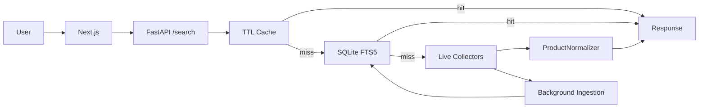

# GlowSearch

K-뷰티 멀티소스 화장품 검색 엔진입니다.

브랜드명, 영문명, 하위 브랜드, 상품명, 카테고리, 색상/호수로 화장품을 검색할 수 있습니다. 여러 신뢰 가능한 소스의 상품 데이터를 정규화·색인하고, TTL 캐시 → SQLite FTS5 인덱스 → 라이브 수집기 순서로 빠르게 결과를 반환합니다.


---

## 배포 링크

| | URL |
| --- | --- |
| Frontend | [https://frontend-plum-six-32.vercel.app](https://frontend-plum-six-32.vercel.app) |
| Backend health | [https://glowsearch-backend.onrender.com/health](https://glowsearch-backend.onrender.com/health) |
| Search API 예시 | [https://glowsearch-backend.onrender.com/search?q=%EB%A1%9C%EC%85%98&limit=4](https://glowsearch-backend.onrender.com/search?q=%EB%A1%9C%EC%85%98&limit=4) |

현재 배포 커밋은 `/health` 응답의 `release_sha`로 확인할 수 있습니다.

---

## 개발 목적

화장품 검색은 한글 브랜드명, 영문 브랜드명, 하위 브랜드, 상품명, 성분명, 카테고리명이 뒤섞여 원하는 상품을 찾기 어렵습니다. `too cool`, `TOO COOL FOR SCHOOL`, `투쿨포스쿨`은 같은 브랜드를 가리키고, `정샘물`로 검색할 때는 `비긴스 바이 정샘물` 같은 하위 브랜드도 함께 고려해야 합니다.

GlowSearch는 매 요청마다 전체를 크롤링하지 않고, 소스 데이터를 수집·정규화·색인해 캐시와 인덱스를 먼저 조회합니다. 뷰티 유튜버 편집자에게 필요한 제품명 정리, 영문명 확인, YouTube 설명란 export 기능도 함께 제공합니다.

---

## 주요 기능

**검색**
- 브랜드명, 영문명, 하위 브랜드, 상품명, 카테고리, 색상/호수 검색
- alias 검색: `too cool` / `TOO COOL FOR SCHOOL` / `투쿨포스쿨` 모두 동일 브랜드 반환
- 하위 브랜드 확장: `정샘물` → `비긴스 바이 정샘물` 포함
- SQLite FTS5 기반 빠른 인덱스 검색
- 자동완성, 페이지네이션

**멀티소스**
- 소스 필터 탭: 전체 / 올리브영 / 무신사 / 공식몰 (탭별 결과 수 badge)
- 올리브영 공개 API, 무신사 뷰티 직접 수집, 브랜드 공식 Shopify 스토어, verified catalog
- 소스별 timeout / retry / graceful fallback
- 라이브 결과를 백그라운드로 인덱스에 저장

**데이터 품질**
- source가 제공하지 않은 값은 절대 만들지 않음 (자동 번역·추측 없음)
- 없는 값은 `미확인` / `N/A` 대신 UI에서 숨김
- `brand_registry.json` 기반 브랜드 한↔영 정규화
- verified catalog로 표시용 상품명, 영문 제품명 override

**편집자 모드**
- 제품 리스트 붙여넣기 → 줄별 브랜드·제품명·호수 파싱 → 소스 기반 후보 매칭
- **YouTube 설명란 일괄 export** (링크 포함 / 텍스트만)
- 호수 parser: `#13N1`, `19호`, `#432`, `#그레이쿨`, `카푸치노` 등 처리

---

## 아키텍처

```
검색어 입력
  → GET /search
  → TTL Cache 조회  →  캐시 히트 시 즉시 반환
  → SQLite FTS5 인덱스 조회  →  인덱스 히트 시 반환 + 백그라운드 refresh
  → 라이브 수집기 (deadline 내)
      - OliveYoung Public API
      - Musinsa Beauty (옵션)
      - Brand Shopify (옵션)
      - LocalVerifiedCatalogCollector
  → ProductNormalizer
  → 결과 반환 + 인덱스 저장
```



---

## 편집자 일괄 정리 모드

뷰티 유튜버 편집자가 원고의 제품 리스트를 붙여넣으면 줄별로 후보 상품을 찾아줍니다.

**사용 흐름**

1. `편집자 일괄 정리` 탭 선택
2. 유튜버가 보낸 제품 리스트를 여러 줄로 붙여넣기
3. `정리하기` → 각 줄을 파싱하고 소스 기반 후보 최대 5개 반환
4. 후보가 여러 개면 편집자가 직접 선택
5. 소스로 확인된 브랜드명, 영문 브랜드명, 제품명, 영문 제품명, 호수 확인
6. **YouTube 설명란** 버튼으로 선택한 제품 전체를 클립보드에 복사

**응답 상태**
- `확인됨` — 소스와 정확히 일치하는 후보 1개
- `후보 있음` — 후보는 있지만 편집자 확인 필요
- `수동 확인 필요` — 소스에서 확인된 상품 없음

```bash
# API 직접 호출 예시
curl -X POST https://glowsearch-backend.onrender.com/editor/batch \
  -H "Content-Type: application/json" \
  -d '{"text":"헤라 파우더 #13N1\n롬앤 쉐딩 #그레이쿨","limit":5}'
```

---

## 데이터 소스 우선순위

| 우선순위 | 소스 |
| --- | --- |
| 1 | Olive Young (공개 API) |
| 2 | Musinsa Beauty |
| 3 | Olive Young Global |
| 4 | 브랜드 공식 홈페이지 (Shopify `/products.json`) |
| 5 | Verified catalog (`verified_products.json`) |
| 6 | 공식/공개 API, JSON-LD |
| 7 | Managed provider |

**데이터 원칙**
- 소스가 제공하지 않은 값은 만들지 않습니다 (자동 번역, 추측 금지)
- `source_url` 또는 `source_product_id` 없는 상품은 결과에서 제외합니다
- Cloudflare 우회, captcha 회피, 약관 위반 scraping은 하지 않습니다
- HTML/browser collector는 기본 비활성화 상태입니다

---

## 기술 스택

| 영역 | 기술 |
| --- | --- |
| Frontend | Next.js 16, TypeScript, Tailwind CSS |
| Backend | FastAPI, Python 3.13 |
| Search Index | SQLite FTS5 |
| HTTP 수집 | httpx (async, timeout/retry/rate limit) |
| Cache | In-memory TTL cache |
| Deployment | Vercel (frontend), Render (backend) |
| Test | pytest, ruff |

---

## 파일 구조

```
GlowSearch/
├── frontend/
│   └── src/
│       ├── app/page.tsx        # 검색 UI, 편집자 모드, 소스 필터, export
│       └── lib/api.ts          # API 클라이언트
│
└── backend/
    ├── app/
    │   ├── api/                # FastAPI routes (/search, /suggest, /editor/batch, /health 등)
    │   ├── cache/              # TTL cache
    │   ├── core/config.py      # 환경 변수 (GLOWSEARCH_ prefix)
    │   ├── data_collector/     # OliveYoung, Musinsa, Shopify, local catalog, adapters
    │   ├── indexing/           # SQLite FTS5 store, catalog job queue
    │   ├── ingestion/          # 수집 pipeline, 품질 검사, enrichment export
    │   ├── normalizer/         # 브랜드 alias, 상품명 정규화
    │   ├── search_engine/      # synonym, intent, ranking
    │   └── service/            # SearchService orchestration
    ├── scripts/                # 운영 스크립트 (ingest, audit, refresh, backfill 등)
    ├── tests/
    └── data/
        ├── brand_registry.json      # 브랜드 한↔영 + 공식 도메인 매핑
        ├── verified_products.json   # 수동 검증 카탈로그 (표시명, 영문명 override)
        └── product_index.sqlite3    # SQLite FTS5 인덱스 (런타임)
```

---

## 로컬 실행

### 백엔드

```bash
cd backend
python3 -m venv .venv
. .venv/bin/activate
pip install -r requirements.txt
uvicorn app.main:app --reload --port 8000
```

### 프론트엔드

```bash
cd frontend
npm install
npm run dev   # http://localhost:3000
```

프론트 로컬 환경변수 (`frontend/.env.local`):

```
NEXT_PUBLIC_API_BASE_URL=http://localhost:8000
```

---

## 환경 변수

모든 백엔드 환경 변수는 `GLOWSEARCH_` 접두사를 사용합니다 (`backend/.env`).

### 필수 / 권장

| 변수 | 기본값 | 설명 |
| --- | --- | --- |
| `NEXT_PUBLIC_API_BASE_URL` | — | 프론트에서 호출할 백엔드 URL |
| `GLOWSEARCH_PRODUCT_INDEX_PATH` | `data/product_index.sqlite3` | Render persistent disk 사용 시 `/var/data/product_index.sqlite3` 권장 |
| `GLOWSEARCH_PRODUCT_INDEX_ADMIN_TOKEN` | — | `/index/catalog/run` 보호 토큰 |

### 수집기

| 변수 | 기본값 | 설명 |
| --- | --- | --- |
| `GLOWSEARCH_OLIVEYOUNG_PUBLIC_API_ENABLED` | `true` | Olive Young 공개 API 활성화 |
| `GLOWSEARCH_MUSINSA_DIRECT_ENABLED` | `false` | 무신사 뷰티 직접 수집기 |
| `GLOWSEARCH_MUSINSA_DIRECT_PAGE_SIZE` | `24` | 무신사 수집기 페이지 크기 |
| `GLOWSEARCH_BRAND_SHOPIFY_ENABLED` | `false` | 브랜드 공식 Shopify 수집기 |
| `GLOWSEARCH_MUSINSA_API_ENABLED` + `_BASE_URL` | `false` | 관리형 Musinsa JSON provider |
| `GLOWSEARCH_OLIVEYOUNG_GLOBAL_API_ENABLED` + `_BASE_URL` | `false` | 관리형 OliveYoung Global provider |
| `GLOWSEARCH_OFFICIAL_BRAND_API_ENABLED` + `_BASE_URL` | `false` | 브랜드 공식몰 JSON provider |

### 타이밍

| 변수 | 기본값 | 설명 |
| --- | --- | --- |
| `GLOWSEARCH_LIVE_COLLECT_DEADLINE_SECONDS` | `3.2` | 라이브 수집 전체 deadline. 커버리지 우선 시 `7.0` 권장 |
| `GLOWSEARCH_BACKGROUND_COLLECT_DEADLINE_SECONDS` | `18.0` | 백그라운드 refresh deadline |
| `GLOWSEARCH_CACHE_TTL_SECONDS` | `180` | 캐시 TTL |

### 인덱스 운영

| 변수 | 기본값 | 설명 |
| --- | --- | --- |
| `GLOWSEARCH_PRODUCT_INDEX_VERIFIED_CATALOG_BACKFILL_ON_STARTUP` | `true` | 시작 시 verified catalog를 인덱스에 적재 |
| `GLOWSEARCH_PRODUCT_INDEX_WARMUP_ON_STARTUP` | `false` | 시작 시 seed warmup 실행 |
| `GLOWSEARCH_PRODUCT_INDEX_BACKGROUND_REFRESH_LIMIT` | `240` | 백그라운드 refresh 수집 개수 |
| `GLOWSEARCH_RESULT_SOURCE_PREFIXES` | `oliveyoung,musinsa,official,...` | 결과에 허용할 소스 목록 |

---

## API 레퍼런스

### `GET /search`

```bash
curl "https://glowsearch-backend.onrender.com/search?q=로션&limit=48"
```

| 파라미터 | 설명 |
| --- | --- |
| `q` | 검색어 |
| `brand` | 브랜드 필터 |
| `min_price` / `max_price` | 가격 범위 |
| `limit` | 반환 개수 (1~480) |

응답 예시:

```json
{
  "query": "로션",
  "count": 1,
  "results": [
    {
      "brand_ko": "에스트라",
      "brand_en": "AESTURA",
      "product_name_ko": "아토베리어365 로션",
      "product_name_en": null,
      "price": 29700,
      "original_price": 33000,
      "sale_price": 29700,
      "discount_rate": 10,
      "source": "oliveyoung",
      "source_url": "https://www.oliveyoung.co.kr/...",
      "offers": [...]
    }
  ]
}
```

### 기타 엔드포인트

| Endpoint | 설명 |
| --- | --- |
| `GET /suggest?q=투&limit=10` | 자동완성 후보 |
| `POST /editor/batch` | 편집자 일괄 정리 |
| `GET /index/status` | 인덱스 상태 |
| `GET /index/catalog/status` | catalog job 상태 |
| `POST /index/catalog/run` | pending job 실행 (admin token 필요) |
| `GET /diagnostics` | 캐시/인덱스/소스/gap 진단 |
| `GET /health` | 상태 및 `release_sha` |

---

## 인덱스 운영

검색 커버리지는 작은 batch를 반복 실행해 확장합니다.

```bash
cd backend

# seed / 브랜드 / 카테고리 / gap 기반 batch 수집
.venv/bin/python scripts/refresh_coverage.py \
  --coverage-pairs 300 --max-jobs 50 --limit 120

# 특정 브랜드 우선 보강
.venv/bin/python scripts/refresh_coverage.py \
  --query "비긴스 바이 정샘물" \
  --no-default-seeds --no-gaps \
  --coverage-pairs 0 --max-jobs 1 --limit 48

# 인덱스 품질 감사
.venv/bin/python scripts/audit_index_quality.py \
  --fail-on-required --fail-on-dirty-display

# brand_registry/normalizer 변경 후 기존 row 재정규화
.venv/bin/python scripts/backfill_index_normalized_fields.py --apply

# 운영 백엔드에서 원격 실행
curl -X POST \
  "https://glowsearch-backend.onrender.com/index/catalog/run?max_jobs=20&limit=120&token=$GLOWSEARCH_PRODUCT_INDEX_ADMIN_TOKEN"
```

### catalog enrichment

영문 제품명, 이미지, 가격이 부족한 상품을 검수 대기열로 내보낼 수 있습니다.

```bash
# 보강 대상 CSV 추출
.venv/bin/python scripts/export_catalog_enrichment_targets.py \
  --max-targets 40 --format csv

# source URL에서 영문명 증거 감사 (catalog 수정 없음)
.venv/bin/python scripts/audit_catalog_enrichment_sources.py \
  --field product_name_en --only-usable --format csv
```

---

## 테스트

```bash
cd backend
.venv/bin/python -m ruff check app tests scripts
.venv/bin/python -m pytest

cd frontend
npm run build
npm run typecheck
```

smoke test:

```bash
cd backend
.venv/bin/python scripts/smoke_search.py \
  --base-url https://glowsearch-backend.onrender.com --limit 4
```

---

## 배포

| 영역 | 플랫폼 | 트리거 |
| --- | --- | --- |
| Frontend | Vercel | `main` 브랜치 push 시 자동 배포 |
| Backend | Render | `main` 브랜치 push 시 자동 배포 |

배포 후 체크리스트:

```bash
curl https://glowsearch-backend.onrender.com/health
curl "https://glowsearch-backend.onrender.com/search?q=롬앤&limit=4"
curl "https://glowsearch-backend.onrender.com/index/status"
```

> **주의**: Render free filesystem은 재배포 시 SQLite 인덱스가 초기화됩니다. 운영 환경에서는 Render persistent disk(`/var/data`)를 마운트하거나 외부 DB로 전환해야 합니다.

---

## 한계와 개선 계획

**현재 한계**
- Olive Young 전체 상품 커버리지 100%는 아직 아닙니다
- Render free filesystem은 재배포 시 인덱스가 초기화됩니다
- 소스/`brand_registry.json`에 없는 영문 브랜드명은 `null`입니다
- 공식 API/제휴 데이터 없이 전체 카탈로그를 안정적으로 유지하는 데 한계가 있습니다

**개선 계획**
- Render persistent disk 또는 Postgres 도입
- Meilisearch/Typesense 기반 오타 허용 검색
- `search_gaps` 기반 자동 warmup
- 브랜드 alias 자동 보강
- 관리형 scraping/API provider 연동
